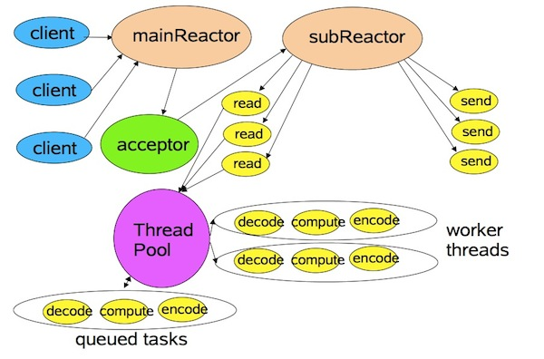

## IO 基础

## socket 和 tcp区别

socket是一种编程，是对TCP和DUP的一种编程

### 阻塞和非阻塞区别、同步和异步区别

当一个read操作发生时，它会经历两个阶段：

1. 等待数据准备(Waitingfor the data to be ready)
2. 将数据从内核拷贝到进程中(Copyingthe data from the kernel to the process)

**阻塞和非阻塞：** 说的是第一个阶段，如果需要等待数据准备好那么就是阻塞的，反之非阻塞  
**同步和异步：** 说的是第二个阶段

记住这两点很重要，因为这些IO Model的区别就是在两个阶段上各有不同的情况。是否阻塞说的是第一个阶段，即等待数据准备阶段是否会阻塞，而是否同步说的是第二阶段，即将数据从内核拷贝到进程这个真实的IO Operation操作阶段是否阻塞。

### reactor、netty、nio区别

reactor是一种设计模式，实现基础是nio；netty是用了reactor模型

### io发展史

单线程bio：一个请求如果被卡住，那么其他的客户端都连不进来 多线程bio：每个请求都是一个线程，但是开销太大 no-blocking io(注意这不是java的nio)
：接受请求（accept）和读取数据（read）都不会阻塞，bio在这两个都会阻塞。但是nio由于不阻塞就要不断循环遍历所有client，即使部分client都没有数据 多路复用IO（Nio: new io）：在nio基础上加了多路复用器。

### select、poll、epoll区别

Select 每次调用select()方法会把所有的fd一起传到内核，fd数量1024个 poll 跟select原理一样但是没有个数限制，是一个链表结构 epoll会在内核开辟一个空间存fd，这样就不用一直传fd，而是由内核通自己循环

---

## reactor

这儿的Reactor相当于netty的NioEventLoopGroup

①单线程模型，所有绿色和黄色的框都是由一根线程执行的

②多线程模式，acceptor和read、send是由一根线程执行。decode、compute、encode由一个线程池执行

③主从模式。acceptor是由一个线程池执行（不过netty里boss一般也只有一个线程），read和send由一根线程执行，decode、compute、encode由另一个线程池执行


mainReactor只有一个，负责响应client的连接请求，并建立连接，它使用一个NIO Selector；subReactor可以有一个或者多个，每个subReactor都会在一个独立线程中执行，并且维护独立的NIO
Selector。 一个客户端生成一个channel，mainReactor开一条线程去轮询它。然后当有事件触发时候交给subReactor去调用事件处理器去处理。

---

## 各种模式的代码

一、 java nio（非多路复用）

```
public class NioServer {
    public static void main(String[] args) throws Exception {
        LinkedList<SocketChannel> clients = new LinkedList<>();

        //这行其实就是对socket端口做的操作，开放端口，绑定端口，监听端口
        ServerSocketChannel ssc = ServerSocketChannel.open();
        ssc.bind(new InetSocketAddress(9090));
        ssc.configureBlocking(false);

        while (true) {
            Thread.sleep(1000);
            SocketChannel client = ssc.accept(); //不会阻塞
            if (client == null) {
                System.out.println("null...");
            } else {
                client.configureBlocking(false);
                System.out.println("有客户端连进来了，port为:" + client.socket().getPort());
                clients.add(client);
            }

            for (SocketChannel channel : clients) {
                //缓冲区，为每一个客户端(channel)单独设置一个缓冲区。用缓冲区是为了提升IO的性能
                ByteBuffer buffer = ByteBuffer.allocateDirect(1024);
                int num = channel.read(buffer); //不会阻塞
                // >0 读到数据了
                if(num > 0) {
                    //filp 缓存读写模式切换，buffer有2个属性一个叫position一个叫limit
                    //当写的时候position就一直在加，执行了filp，position位置归0，并且把值赋给limit
                    //然后就可以读了，一直读到position等于limit为止
                    buffer.flip();
                    byte[] data = new byte[buffer.limit()];
                    buffer.get(data);

                    System.out.println("服务端获取数据:" + new String(data));
                }
            }
        }
    }
}
```

二、 java nio（多路复用）

reactor有三种线程模型

1. 单线程模型，accept和read、write都是由同一个线程执行，即本类这样的写法
2. 多线程模型，accept不变，仅仅read、write里业务处理改为线程池
3. 主从模式，accept和read、write用不同的线程和不同的selector

```
// 单线程模型
public class SelectorSingleThreadServer {
    private static ServerSocketChannel ssc;
    private static Selector selector;

    static {
        try {
            ssc = ServerSocketChannel.open();
            ssc.bind(new InetSocketAddress(9090));
            ssc.configureBlocking(false);

            //selector是java对多路复用器的一种封装，他下面有3种命令：select、poll、epoll
            //select和poll差不多，我们要知道linux下所有对象就是文件，每一个文件都有一个fd（文件描述符）
            //每个客户端（channel）都会产生一个fd，select和poll会在程序内存里保存这些fd，并且每次都需要把他们传到内核里去
            //epoll分为3个命令：epoll_create、epoll_ctl、epoll_wait。他会把文件描述符直接写到内存里，而不是由内存保存
            //然后每次只要询问即可，不需要把文件描述符传到内核
            //这句如果是epoll，那么会执行epoll_create；如果是select或者poll没啥事
            selector = Selector.open();
            //这句就是把fd写到内核去，调用epoll_ctl。例如ssc对象文件描述符是7，那么在内核里就写入 7 ---> accept事件
            ssc.register(selector, SelectionKey.OP_ACCEPT);
        } catch (IOException e) {
            e.printStackTrace();
        }
    }

    public static void main(String[] args) throws Exception {
        while (true) {
            //这儿就是询问内核是否有事件到来，调用epoll_wait或者select或者poll；
            while (selector.select(0) > 0) {
                Set<SelectionKey> selectionKeys = selector.selectedKeys();
                Iterator<SelectionKey> iterator = selectionKeys.iterator();
                while (iterator.hasNext()) {
                    SelectionKey key = iterator.next();
                    iterator.remove();
                    if (key.isAcceptable()) {
                        acceptHandler(key);
                    } else {
                        readHandler(key);
                    }
                }
            }
        }
    }

    private static void acceptHandler(SelectionKey key) throws Exception {
        ServerSocketChannel ssc = (ServerSocketChannel) key.channel();
        SocketChannel client = ssc.accept();//三次握手
        client.configureBlocking(false);
        ByteBuffer buffer = ByteBuffer.allocateDirect(1024);
        client.register(selector, SelectionKey.OP_READ, buffer);
        System.out.println("有客户端连进来了，port为:" + client.socket().getPort());
    }

    private static void readHandler(SelectionKey key) throws Exception {
        SocketChannel client = (SocketChannel) key.channel();
        ByteBuffer buffer = (ByteBuffer) key.attachment();
        buffer.clear();

        int read;
        while (true) {
            read = client.read(buffer);
            // >0 有数据 0 没数据 -1 客户端断开
            if (read > 0) {
                buffer.flip();
                while (buffer.hasRemaining()) {
                    //写回客户端
                    client.write(buffer);
                }
                buffer.clear();
            } else if (read == 0) {
                break;
            } else {
                client.close();
                break;
            }
        }
    }
}

//主从模式，accept和read、write用不同的线程和不同的selector
//本例为一主两从
public class SelectorMasterSlaver {
    private static ServerSocketChannel ssc;
    private static Selector masterSelector;
    private static Selector slaverSelector1;
    private static Selector slaverSelector2;

    static {
        try {
            ssc = ServerSocketChannel.open();
            ssc.bind(new InetSocketAddress(9090));
            ssc.configureBlocking(false);

            masterSelector = Selector.open();
            slaverSelector1 = Selector.open();
            slaverSelector2 = Selector.open();

            ssc.register(masterSelector, SelectionKey.OP_ACCEPT);
        } catch (Exception e) {
            e.printStackTrace();
        }
    }

    public static void main(String[] args) throws Exception {
        Thread t1 = new NioThread(masterSelector, 2);
        Thread t2 = new NioThread(slaverSelector1);
        Thread t3 = new NioThread(slaverSelector2);

        t1.start();
        Thread.sleep(1000);
        t2.start();
        t3.start();
    }
}

class NioThread extends Thread {
    private static LinkedBlockingQueue<SocketChannel>[] queues;
    private static AtomicInteger count = new AtomicInteger();
    private static int slaverNum;

    private int id;
    private Selector selector;

    NioThread(Selector selector, int slaverNum) {
        this.selector = selector;
        this.slaverNum = slaverNum;
        this.id = 2;
        queues = new LinkedBlockingQueue[slaverNum];
        IntStream.range(0, slaverNum).forEach(it -> queues[it] = new LinkedBlockingQueue<>());
        System.out.println("boss线程启动");
    }

    NioThread(Selector selector) {
        this.selector = selector;
        id = count.getAndIncrement() % slaverNum;
        System.out.println("worker线程" + id + "启动");
    }

    @Override
    public void run() {
        try {
            while (true) {
                while (selector.select(100) > 0) {
                    Set<SelectionKey> selectionKeys = selector.selectedKeys();
                    Iterator<SelectionKey> iterator = selectionKeys.iterator();
                    while (iterator.hasNext()) {
                        SelectionKey key = iterator.next();
                        iterator.remove();
                        if (key.isAcceptable()) {
                            acceptHandler(key);
                        } else {
                            readHandler(key);
                        }
                    }
                }

                if (id != 2) {
                    SocketChannel client = queues[id].poll();
                    if (client != null) {
                        ByteBuffer buffer = ByteBuffer.allocateDirect(1024);
                        client.register(selector, SelectionKey.OP_READ, buffer);
                        System.out.println("注册了读事件");
                    }
                }
            }
        } catch (Exception e) {
            e.printStackTrace();
        }
    }

    private void acceptHandler(SelectionKey key) throws Exception {
        ServerSocketChannel ssc = (ServerSocketChannel) key.channel();
        SocketChannel client = ssc.accept();
        client.configureBlocking(false);
        int n = count.getAndIncrement() % slaverNum;
        queues[n].add(client);
        System.out.println("有客户端连进来了，port为:" + client.socket().getPort() + ", client进入队列" + n);
    }

    private void readHandler(SelectionKey key) throws Exception {
        SocketChannel client = (SocketChannel) key.channel();
        ByteBuffer buffer = (ByteBuffer) key.attachment();
        buffer.clear();

        int read;
        while (true) {
            read = client.read(buffer);
            // >0 有数据 0 没数据 -1 客户端断开
            if (read > 0) {
                buffer.flip();
                while (buffer.hasRemaining()) {
                    //写回客户端
                    client.write(buffer);
                }
                buffer.clear();
            } else if (read == 0) {
                break;
            } else {
                client.close();
                break;
            }
        }
    }
}
```

三、 netty服务端

```
public class NettyServer {
    public static void main(String[] args) throws Exception {
        //1 第一个线程组 是用于接收Client端连接的
        EventLoopGroup bossGroup = new NioEventLoopGroup();
        //2 第二个线程组 是用于IO读写或者实际的业务处理操作的
        EventLoopGroup workerGroup = new NioEventLoopGroup();
        //3 创建一个辅助类Bootstrap，就是对我们的Server进行一系列的配置
        ServerBootstrap b = new ServerBootstrap();
        //把俩个工作线程组加入进来
        b.group(bossGroup, workerGroup)
                //我要指定使用NioServerSocketChannel这种类型的通道
                .channel(NioServerSocketChannel.class)
                .option(ChannelOption.SO_BACKLOG, 1024)
                //设置日志,netty默认日志
                .handler(new LoggingHandler(LogLevel.INFO))
                //一定要使用 childHandler 去绑定具体的 事件处理器
                .childHandler(new ChannelInitializer<SocketChannel>() {
                    @Override
                    protected void initChannel(SocketChannel sc) throws Exception {
                        //解码，使用jboss的marshalling时候它也解决了粘包拆包问题，原理是报文头部加上4个字节表示数据长度
//                        sc.pipeline().addLast(MarshallingCodeCFactory.buildMarshallingEncoder());
                        //编码
//                        sc.pipeline().addLast(MarshallingCodeCFactory.buildMarshallingDecoder());
                        //解决粘包方法一：利用分隔符
                        //ByteBuf buf = Unpooled.copiedBuffer("$_".getBytes());
                        //解决粘包方法二：利用定长解析
//                        sc.pipeline().addLast(new FixedLengthFrameDecoder(5));
//                        sc.pipeline().addLast(new DelimiterBasedFrameDecoder(1024, buf));
//                        sc.pipeline().addLast(new StringDecoder());
                        sc.pipeline().addLast(new ServerHandler());
                    }
                });
        //绑定指定的端口 进行监听
        ChannelFuture f = b.bind(8765).sync();

        //下面这句相当于Thread.sleep(1000000);
        f.channel().closeFuture().sync();

        bossGroup.shutdownGracefully();
        workerGroup.shutdownGracefully();
    }
}

public class ServerHandler  extends ChannelHandlerAdapter {
     @Override
     public void channelRead(ChannelHandlerContext ctx, Object msg) throws Exception {
     
              System.out.println("Server: " + (String)msg);
              //写给客户端
              String response = "服务器响应";
              ctx.writeAndFlush(response);
     }
     @Override
     public void exceptionCaught(ChannelHandlerContext ctx, Throwable cause) throws Exception {
          cause.printStackTrace();
          ctx.close();
     }
}
```