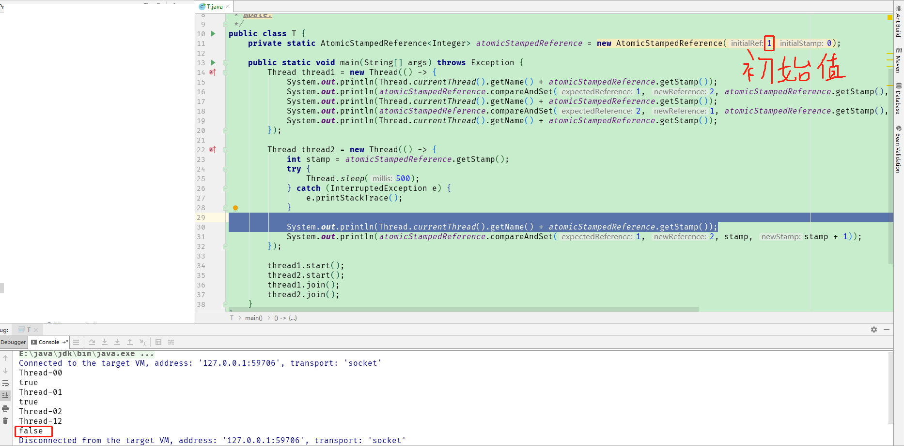
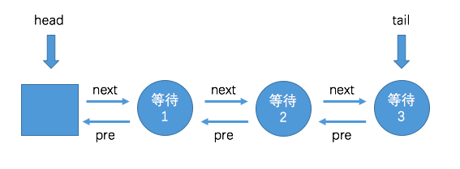
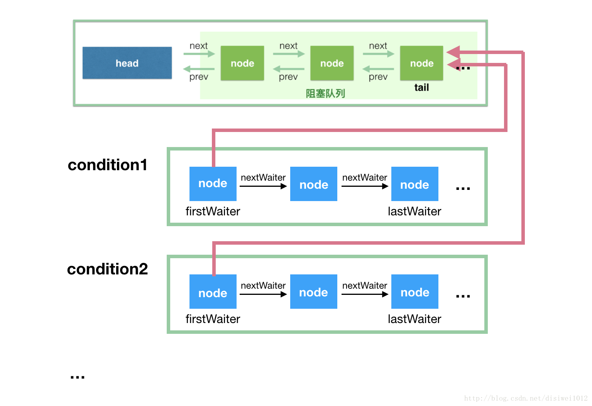
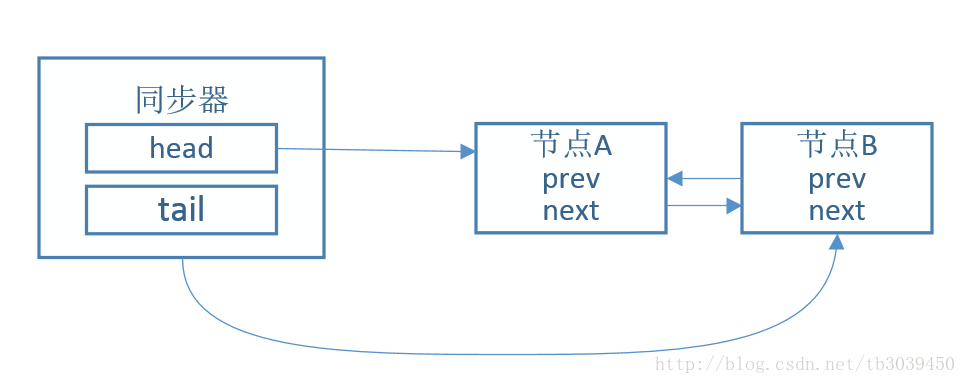
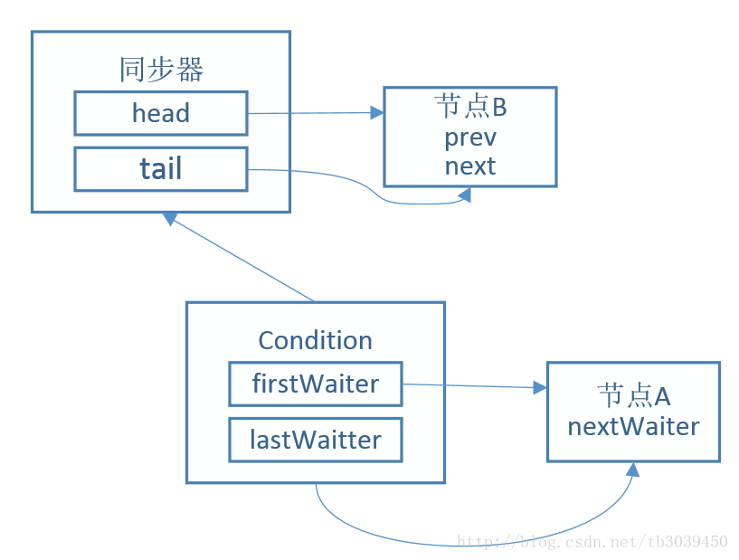
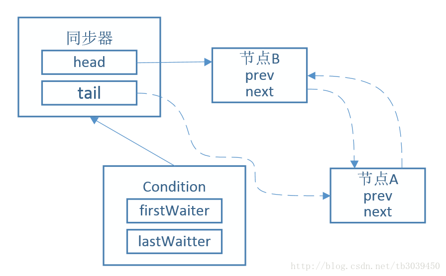

## cas（compareAndSwap）

是以乐观锁思想实现的一种原子操作（读改写）算法。简而言之cas是在读和改之间做了操作，改和写交给底层命令保证原子性。

### 汇编指令

cmpxchg(new_val, dest_int, cur);

### 原理

unsafe是java底层实现cas的工具类。  
unsafe.compareAndSwapXXX有4个参数：  
1、当前对象   
2、value内存地址偏移量（value是AtomicInteger一个属性）  
3、期望值（其实也是value）  
4、要修改的值。这个命令是用C++来写的，里头会上锁。

通过当前对象和和偏移量可以找到内存里的值，与期望值对比，一样则用修改的值进行更新，返回true，不一样（说明期间被人修改过了），返回false

### cas经典的ABA问题

A先变成B再变成A，cas会认为他没变。  
解决方法①加上版本，②用AtomicStampedReference

---

## aqs（AbstractQueueSynchronizer）

是JUC（java.util.concurrent）包的核心类。

首先有个volatile int
state，他的原理跟synchronizerd有点像。aqs分为独占（ReetrantLock）和共享（CountDownLatch）。stat就是锁，独占和共享区别对于stat是只能一个线程获取还是可以多个线程同时获取

#### 独占模式

以ReentrantLock为例，state初始化为0，表示未锁定状态。A线程lock(执行acquire方法)时，会先用cas将aqs的state属性由0->1，如果失败了, 进入CLH队列。当unlock(执行release方法)
时候，会cas将state减1，然后将CLH队首的线程唤醒，在cas去尝试将state由0->1。 acquire和release是对应的，前者是独占模式获取，后者是独占模式释放

#### 共享模式

再以CountDownLatch为例，任务分为N个子线程去执行，state也初始化为N（注意N要与线程个数一致）。这N个子线程是并行执行的，每个子线程执行完后countDown(执行releaseShared方法)
一次，state会CAS减1。执行await（执行acquireSharedInterruptibly方法）方法的线程会进入队列并挂起（park），等到state变为0，会唤醒队首的线程，该线程会一个一个传递下去，唤醒队列所有线程。
acquireShared和releaseShared是对应的，前者是共享模式获取，后者是共享模式释放。

#### tips

使用aqs:
acquire、release、acquireShared、releaseShared都是aqs定义好的方法可以直接使用，我们只要实现tryacquire、tryrelease、tryacquireShared、tryreleaseShared（实际上tryXXXX系列接口都是对stat操作，包括公平锁和非公平锁，至于队列我们完全不用想，acquire系列接口都帮我们做了，我们只要处理好stat即可）

### await和signal原理

1、假设初始状态如下，节点A、节点B在同步队列中。

2、节点A的线程获取锁权限，此时调用await方法。节点A从同步队列移除， 并加入条件队列中。

3、调用 signal方法，从条件队列中取出第一个节点，并加入同步队列中，等待获取资源

所属的线程挂起，当重新唤醒后，如果发生中断，会直接抛出异常，并将该节点从同步队列中删除。(为了判断挂起这段时间内线程是否被中断)

---

以上都是说同步队列（双向队列），AQS里还有个内部类(ConditionObject)实现了condition接口，里头有个条件队列（单向队列）
1、await时候会把当前线程放到条件队列里，从同步队列删除（删除节点，释放锁state置0），再判断是否在同步队列里，不存在则挂起。当被singal唤醒后，插入同步队列队尾
2、signal先判断是否是独占模式，不是则报错。是的话把node加入到同步队列队尾。
