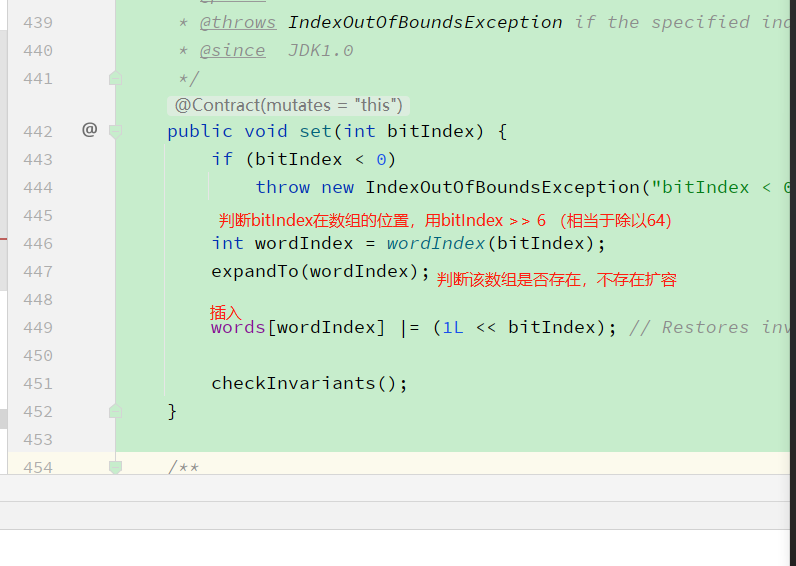

## 布隆过滤器

<font color=red>**一定不存在，可能存在**</font>

### 场景

布隆过滤器的巨大用处就是，能够迅速判断一个元素是否在一个集合中。因此他有如下三个使用场景:

1. 网页爬虫对URL的去重，避免爬取相同的URL地址
2. 反垃圾邮件，从数十亿个垃圾邮件列表中判断某邮箱是否垃圾邮箱（同理，垃圾短信）
3. 缓存穿透，将所有可能存在的数据缓存放到布隆过滤器中，当黑客访问不存在的缓存时迅速返回避免缓存及DB挂掉。

### 原理

其内部维护一个全为0的bit数组，需要说明的是，布隆过滤器有一个误判率的概念，误判率越低，则数组越长，所占空间越大。误判率越高则数组越小，所占的空间越小。 假设，根据误判率，我们生成一个10位的bit数组，以及2个hash函数（(
f_1,f_2)），如下图所示(生成的数组的位数和hash函数的数量，我们不用去关心是如何生成的，有数学论文进行过专业的证明)。

假设输入集合为((N_1,N_2)),经过计算(f_1(N_1))得到的数值得为2，(f_2(N_1))得到的数值为5，则将数组下标为2和下表为5的位置置为1，如下图所示

同理，经过计算(f_1(N_2))得到的数值得为3，(f_2(N_2))得到的数值为6，则将数组下标为3和下表为6的位置置为1，如下图所示

这个时候，我们有第三个数(N_3)，我们判断(N_3)在不在集合((N_1,N_2))中，就进行(f_1(N_3)，f_2(N_3))的计算

1. 若值恰巧都位于上图的红色位置中，我们则认为，(N_3)在集合((N_1,N_2))中
2. 若值有一个不位于上图的红色位置中，我们则认为，(N_3)不在集合((N_1,N_2))中 以上就是布隆过滤器的计算原理，下面我们进行性能测试，

### 性能测试

代码如下:  
(1)新建一个maven工程，引入guava包

```
<dependency>
    <groupId>com.google.guava</groupId>
    <artifactId>guava</artifactId>
    <version>22.0</version>
</dependency>
```

(2)测试一个元素是否属于一个百万元素集合所需耗时

```
import java.util.ArrayList;import java.util.List;
import com.google.common.hash.BloomFilter;
import com.google.common.hash.Funnels;

public class Test {
private static int size = 1000000;
private static BloomFilter<Integer> bloomFilter =BloomFilter.create(Funnels.integerFunnel(), size);
public static void main(String[] args) {
for (int i = 0; i < size; i++) {
bloomFilter.put(i);
}
List<Integer> list = new ArrayList<Integer>(1000);
//故意取10000个不在过滤器里的值，看看有多少个会被认为在过滤器里
for (int i = size + 10000; i < size + 20000; i++) {
if (bloomFilter.mightContain(i)) {
list.add(i);
}
}
System.out.println("误判的数量：" + list.size());
}
}
```

输出结果如下  
误判对数量：330  
如果上述代码所示，我们故意取10000个不在过滤器里的值，却还有330个被认为在过滤器里，这说明了误判率为0.03.即，在不做任何设置的情况下，默认的误判率为0.03。

下面上源码来证明：
        
接下来我们来看一下，误判率为0.03时，底层维护的bit数组的长度如下图所示

将bloomfilter的构造方法改为 private static BloomFilter<Integer> bloomFilter = BloomFilter.create(Funnels.integerFunnel(),
size,0.01); 即，此时误判率为0.01。在这种情况下，底层维护的bit数组的长度如下图所示

由此可见，误判率越低，则底层维护的数组越长，占用空间越大。因此，误判率实际取值，根据服务器所能够承受的负载来决定，不是拍脑袋瞎想的。

### 实际使用

redis伪代码如下所示

```
String get(String key) {
String value = redis.get(key);
if (value == null) {
if(!bloomfilter.mightContain(key)){
return null;
}else{
value = db.get(key);
redis.set(key, value);
}
}
return value；
}
```

优点

1. 思路简单
2. 保证一致性
3. 性能强 缺点
1. 代码复杂度增大
2. 需要另外维护一个集合来存放缓存的Key
3. 布隆过滤器不支持删值操作

---

## bitset&bimap

### bitset结构

    用long[] 来存存储

### bitset原码分析

以下分析set的过程

其余方法：


### bitmap

bitmap是一种数据结构，java就是用bitset来实现bitmap