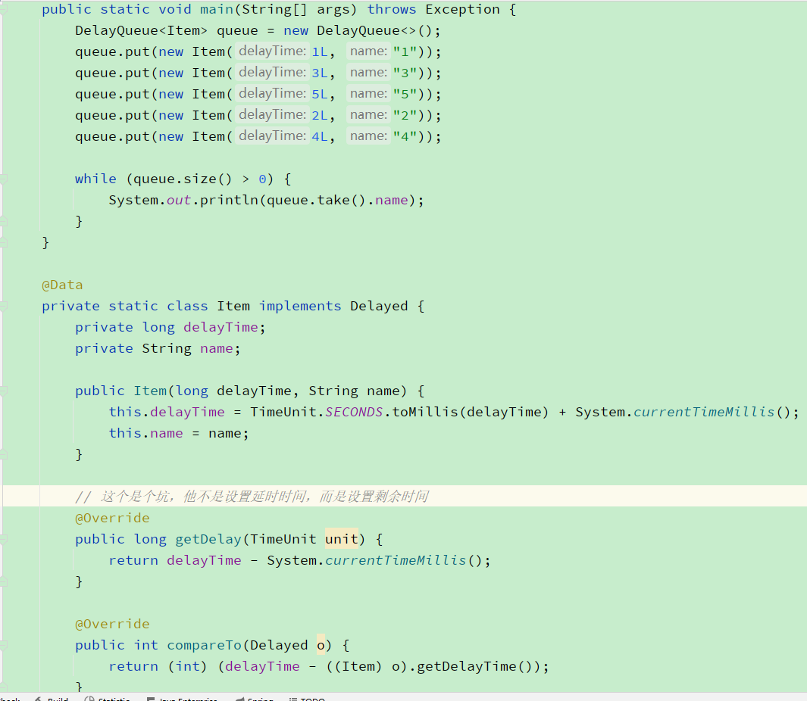
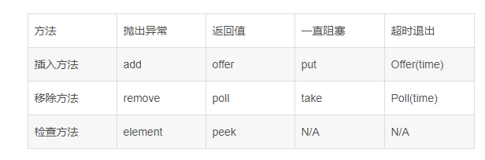

## 概念区别

- **阻塞、非阻塞：** 阻塞就是队列满了，会等待直到消费了才放入，或者从空队列取，会等到有生产了才返回。非阻塞就是立刻返回。
- **有界、无界：** 队列是否有长度

### 非阻塞队列

- ConcurrentLinkedQueue无阻塞无界限队列，高并发性能最好，peek（查看）取出不删除，poll取出删除。用**cas**实现。
- ConcurrentLinkedDeque：同上

### 阻塞队列

- ArrayBlockingQueue阻塞有界队列：用1个ReentrantLock，2个condition，2个index形成环形数组。
-
LinkBlockingQueue阻塞无界队列：用2个ReentrantLock，2个condition，2个index（没有设置大小为无界，有设置为有界。生产者消费者首选，put方法会阻塞，take方法会阻塞，poll方法没有就返回null）。
- LinkedBlockingDeque: 同上
- PriorityBlockingQueue阻塞无界队列： 元素可以自动排序，不过元素需要实现comparable接口
- SynchronousQueue阻塞有界队列： 不存储任何元素，put时候会阻塞，直到take。**基于 CAS 和 LockSupport 实现**
- LinkedTransferQueue阻塞无界队列
    - JDK 7 新增，单向链表实现的无界阻塞队列，通过 CAS 实现并发访问，队列元素使用 FIFO(先进先出)方式
    - LinkedTransferQueue 可以说是 SynchronousQueue、LinkedBlockingQueue、ConcurrentLinkedQueue 三者的合集，**使用 CAS 代替
      ReentrantLock 来提高性能，同时不限制队列长度**
    - 当 put 时，如果有等待的线程，就直接将元素 “交给” 等待者， 否则直接进入队列。
    - 当 transfer 时，put 是立即返回的， transfer 是阻塞等待消费者拿到数据才返回。transfer方法和 SynchronousQueue的 put
      方法类似。参考:https://www.jianshu.com/p/ae6977886cec
- DelayQueue阻塞无界队列： 队列元素可以设置延时和排序，元素需要实现delayed接口，重写getDealy和compareTo方法。**基于 ReentrantLock 和 Condition 实现**
  

### 队列的方法

1.获取  
poll()   获取并移除此队列的头，如果此队列为空，则返回 null  
peek()    查看，获取队列的头但不移除此队列的头。如果此队列为空，则返回 null  
take()     用于阻塞队列，没有的话阻塞

2.插入  
offer()  将指定的元素插入此队列（如果立即可行且不会违反容量限制），插入成功返回 true；否则返回 false。当使用有容量限制的队列时，offer方法通常要优于add方法  
add()    将指定的元素插入此队列，当无法插入元素，抛出一个 IllegalStateException异常    
put()     用于阻塞队列，满了的话阻塞  

