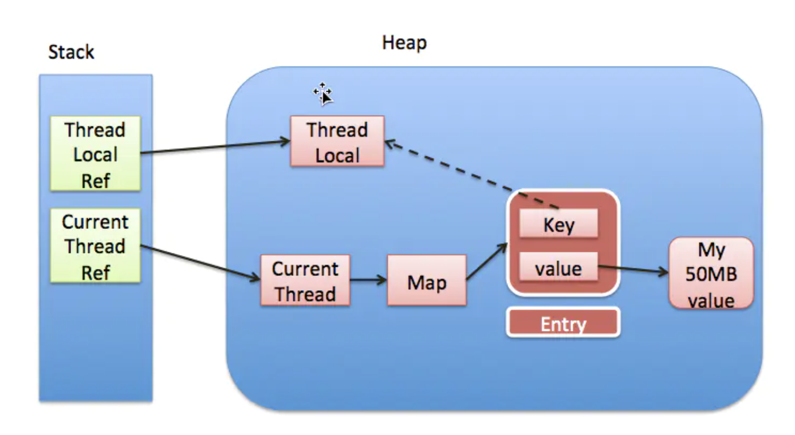

## 线程状态

1. 初始(NEW)：新创建了一个线程对象，但还没有调用start()方法。
2. 运行(RUNNABLE)：Java线程中将就绪（ready）和运行中（running）两种状态笼统的称为“运行”。
   线程对象创建后，其他线程(比如main线程）调用了该对象的start()方法。该状态的线程位于可运行线程池中，等待被线程调度选中，获取CPU的使用权，此时处于就绪状态（ready）。就绪状态的线程在获得CPU时间片后变为运行中状态（running）。
3. 阻塞(BLOCKED)：表示线程阻塞于锁。
4. 等待(WAITING)：进入该状态的线程需要等待其他线程做出一些特定动作（通知或中断）。
5. 超时等待(TIMED_WAITING)：该状态不同于WAITING，它可以在指定的时间后自行返回。
6. 终止(TERMINATED)：表示该线程已经执行完毕

---

## 线程
### Thread的yield和interrupt方法
yeild：让出。让出当前cpu，是线程回到就绪状态，等下一次CPU分配时间片，这个时间不固定
interrupt：中断。它的作用仅仅是为线程设定一个状态而已，即标明线程是中断状态，这样线程的调度机制或我们的代码逻辑就可以通过判断这个状态做一些处理，比如sleep()方法会抛出异常，或是我们根据isInterrupted()方法判断线程是否处于中断状态，然后做相关的逻辑处理
join: 等待另一个线程执行完。xxx线程join到当前线程，当前线程要等xxx线程执行完才能继续执行

---

## ThreadLocal
### 原理
1. ThreadLocal有个静态内部类ThreadLocalMap，他自定义了一个Entry，这个entry的key是当前对象（threadlocal）的弱引用，value就是我们设置的值。Thread会持有这个map
2. 我们set时候，会从当前线程（thread）里取这个map，有则插入，无则新建后插入

### 内存泄露原因
先盗一张网上的图  

上面说到entry的key是弱引用，那么当没有对当前threadlocal有强引用时候，下一次gc会被回收，但是thread持有ThreadLocalMap，这个map又持有entry数组，是强引用，所以entry不会被回收，那么此时的entry就是内存泄露。  
PS：其实要真正达到内存泄露还要注意几个点：1、对threadlocal没有强引用，比如threadlocal = null; 2、没有调用set、get、remove方法，因为这些方法执行前会清除没用的entry  

---

## Future
是一个接口，他有很多实现，其中FutureTask就是最简单实现

---

### FutureTask
<font color=red>**futuretask同时实现了future和runnable**</font>
futuretask有一个属性callable，不管你入参是runnable还是callable都会被封装放到这个属性去
可以直接new也可以继承他，最主要作用可以在任务执行完或者异常执行自定义操作（done方法）

---

### CompletableFuture
也是<font color=red>**future的实现类**</font>，它主要是<font color=red>**拓展了future的功能**</font>  
主要有2点  
1. 支持串行、并行，连接多个任务
2. 不需要get方法阻塞，真正的异步
```
public static void main(String[] args) throws ExecutionException, InterruptedException {
    /*
     * async 的意思就是不使用当前线程，而是从线程池里再拿一条线程执行
     * 以下基本每个方法都分为有async和没有async，以下并没有全部列举
     */

    //============= runAsync supplyAsync ==============//
    // runAsync 没有返回值，可以指定自己的线程池
    CompletableFuture<Void> runAsync = CompletableFuture.runAsync(() -> {
        System.out.println("runAsync:" + "runAsync");
    });
    // supplyAsync 有返回值，可以指定自己的线程池
    CompletableFuture<String> supplyAsync = CompletableFuture.supplyAsync(() -> {
        System.out.println("supplyAsync:" + "supplyAsync");
        return "supplyAsync";
    });

    //============= whenComplete、whenCompleteAsync、exceptionally ==============//
    //计算完成后执行的回调方法
    runAsync.exceptionally((throwable -> {
        System.out.println("exceptionally:" + throwable);
        return null;
    }));

    // get了就结束了，但是如果返回CompletableFuture对象则可以继续往下嵌套方法
    String s = supplyAsync.whenComplete((value, throwable) -> {
        System.out.println("whenComplete:" + value);
    }).get();
    System.out.println("whenComplete:" + s);

    CompletableFuture<String> whenCompleteAsync = supplyAsync.whenCompleteAsync((value, throwable) -> {
        System.out.println("whenCompleteAsync:" + value);
    });

    //============= thenApply 、 thenApplyAsync、 handle、 thenAccept 、 thenAcceptAsync、 thenRun、 thenRunAsync ==============//
    // thenApply 、 thenApplyAsync只能处理正常情况，异常不会执行，有返回
    runAsync.thenApply(value -> {
        System.out.println("thenApply:" + value);
        return null;
    });
    whenCompleteAsync.thenApplyAsync(value -> {
        System.out.println("thenApplyAsync:" + value);
        return null;
    });

    // 正常异常都能执行，又返回
    whenCompleteAsync.handle((value, throwable) -> {
        System.out.println("handle:" + value);
        return null;
    });

    // 跟thenApply差不多，只是他没有返回值
    whenCompleteAsync.thenAccept(value-> {
        System.out.println("thenAccept:" + value);
    });

    // 在前面任务完成后继续执行下一个任务，并不会携带上一个任务的结果，不能处理异常，没有返回值
    whenCompleteAsync.thenRun(()-> {
        System.out.println("thenRun");
    });

    //============= thenCombine 、 thenAcceptBoth、 thenAcceptBothAsync、 runAfterBoth、 allOf ==============//
    // thenCombine 同时接收多个任务的返回结果
    CompletableFuture<String> thenCombine = runAsync.thenCombine(whenCompleteAsync, (s1, s2) -> {
        return "s1:" + s1 + " s2:" + s2;
    });
    System.out.println("thenCombine:" + thenCombine.get());

    // thenAcceptBoth 跟thenCombine差不多只是他没有返回值
    runAsync.thenAcceptBoth(whenCompleteAsync, (s1, s2) -> {
        System.out.println("thenAcceptBoth: s1:" + s1 + " s2:" + s2);
    });

    // runAfterBoth，不接收上一个任务的结果，
    runAsync.runAfterBoth(whenCompleteAsync, () -> {
        System.out.println("whenCompleteAsync");
    });

    // allOf 就是等所有任务都完成
    CompletableFuture.allOf(runAsync, whenCompleteAsync).join();


    //============= applyToEither 、 acceptEither、 runAfterEither、 anyOf  ==============//
    // 那个任务先完成就继续下一个任务 applyToEither有返回，acceptEither无返回， runAfterEither没有入参
    whenCompleteAsync.applyToEither(whenCompleteAsync, s1 -> {
        System.out.println();
        return "";
    });

    // anyOf 就是第一完成，就继续往下走
    CompletableFuture.anyOf(runAsync, whenCompleteAsync).join();
}
```

---

### CompletionService
completionService是对ExecutorService的增强封装，因为ExecutorService只能返回Future，completionService他的api跟ExecutorService基本上都差不多，但是多了一个take，他可以返回最先完成的Future。他内部维护一个LinkBlockingQueue，用来存放完成的任务。  
```
// 初始化 executor 和 completionService
executor = Executors.newFixedThreadPool(4);
completionService = new ExecutorCompletionService<>(executor);

// 提交任务
completionService.submit(createTask.apply(5, 1000));
completionService.submit(createTask.apply(6, 800));
completionService.submit(createTask.apply(7, 600));
completionService.submit(createTask.apply(8, 400));

// 取结果
for (int i = 0; i < 4; i++) {
   log(completionService.take().get());
}
```

---

## 线程池
### jdk提供的线程池
1. newFixedThreadPool(coun t)：定长线程池，最多可同时执行 count 个任务，线程池的线程数量达 corePoolSize 后，即使线程池没有可执行任务时，也不会释放线程，具体实现为 new ThreadPoolExecutor(nThreads, nThreads,0L, TimeUnit.MILLISECONDS, new LinkedBlockingQueue())，因此，工作队列为无界队列，导致 maximumPoolSize 和 keepAliveTime 以及 handler 将会是个无用参数，且永远不会执行拒绝策略
2. newSingleThreadExecutor：只有一个线程，如果该线程异常结束，会重新创建一个新的线程继续执行任务，唯一的线程可以保证所提交任务的顺序执行，由于使用了无界队列，所以也不会执行拒绝策略
3. newCachedThreadPool：实现为 new ThreadPoolExecutor(0, Integer.MAX_VALUE, 60L, TimeUnit.SECONDS, new SynchronousQueue())，最大线程数可达到 Integer.MAX_VALUE，即 2147483647

### 线程池参数
int corePoolSize：核心线程数
int maximumPoolSize：最大线程数
long keepAliveTime：空闲线程存活时间（空闲线程：大于核心线程数的那些线程，没任务时候还存活多久）
TimeUnit unit：空闲线程存活时间单位
BlockingQueue<Runnable> workQueue：阻塞队列
ThreadFactory threadFactory：线程工厂，可以设置线程名字，线程错误捕获等
RejectedExecutionHandler handler：拒绝策略

### 拒绝策略
CallerRunsPolicy：用主线程执行
AbortPolicy：默认，直接抛错
DiscardPolicy：直接丢弃，不抛错
DiscardOldestPolicy：丢弃最早的任务，然后执行

### 线程池允许原理
1. 线程池首先当前运行的线程数量是否少于 corePoolSize，如果少于，则创建新线程来执行任务
2. 当线程数达到 corePoolSize 后，后续的任务（Runnable）将放入 workQueue
3. 当 workQueue 也满了之后，则继续开启新线程执行任务，直到总线程数达到 maximumPoolSize 为止
4. 当总线程数达到 maximumPoolSize，之后再有新的任务，则交给拒绝策略（RejectedExecutionHandler）来处理

### 自定义线程池
```
// 仅仅是举例，这个线程池在线程用完后阻塞到有线程为止
public static ThreadPoolExecutor activeExecutor = new ThreadPoolExecutor(20, 40, 100,
    TimeUnit.MILLISECONDS, new SynchronousQueue<>(), Executors.defaultThreadFactory(), (r, executor) -> {
        try {
            executor.getQueue().put(r);
        } catch (InterruptedException e) {
            e.printStackTrace();
        }
});
```

### 关闭线程池
1. shutdown：将线程池里的线程状态设置成 SHUTDOWN 状态, 然后中断所有没有正在执行任务的线程
2. shutdownNow：将线程池里的线程状态设置成 STOP 状态, 然后停止所有正在执行或暂停任务的线程
3. 只要调用这两个关闭方法中的任意一个, isShutDown() 返回 true， 当所有任务都成功关闭了, isTerminated()返回 true

### 延时定时任务线程池
```
ScheduledExecutorService service = Executors.newScheduledThreadPool(num);
延时执行：
//延时n秒执行
service.schedule(Runnable, n, TimeUnit.SECONDS);
service.schedule(Callable, n, TimeUnit.SECONDS);
循环执行：
//循环执行任务，首先延时m秒执行，n秒循环一次
service.scheduleAtFixedRate(Runnable, m, n, TimeUnit.SECONDS);
```

### 延时定时任务Timer
```
public class M {
public static void main(String[] args) {
   Timer timer = new Timer();
   timer.schedule(new MyTask(), 1000, 2000);
}

class MyTask extends TimerTask {
   @Override
   public void run() {
      System.out.println("dddd");
   }
}
```

### 创建线程5种方式
1. 一个类法继承Thread，然后在main里实例化该方法，并执行start
2. 一个类实现Runnable，然后在main里实例化Thread线程（类的对象放里头），并执行start。
3. 一个普通类，然后在main里实例化Thread线程（Thread tt = new (new Runable(){重写run方法})）
4. 使用Excutor，exec.execute(new 一个实现Runnable的类 )
5. 使用Excutor，exec.execute(new Runnable(){} 

### 注意易错点
这个部分大多为本人工作中的经验教训
1. 线程池里包括线程不会将异常抛到外面，进而无法打印。他会打印工作台但是不会被线程池外面的trycatch捕获，这点我查了很多资料都不完美，所以要养成线程里操作都用trycatch裹起来的习惯
2. 线程抛错，那么该线程就死了，线程池会重新创建。之前有个redis分布式锁的工具类value用到了线程id，这样就无法删除锁了

---