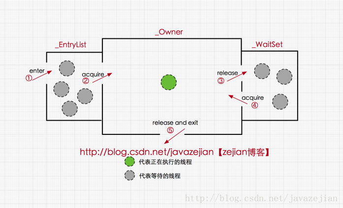
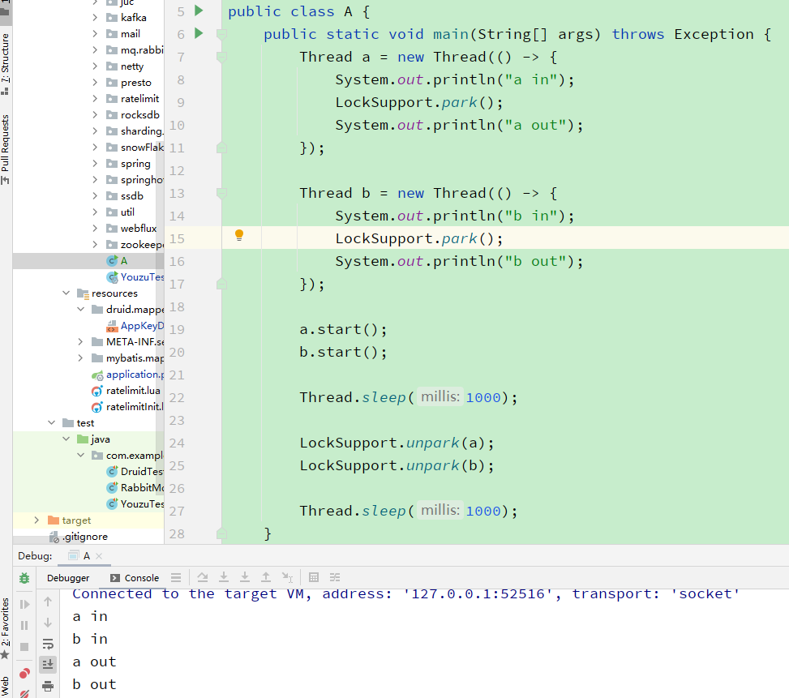
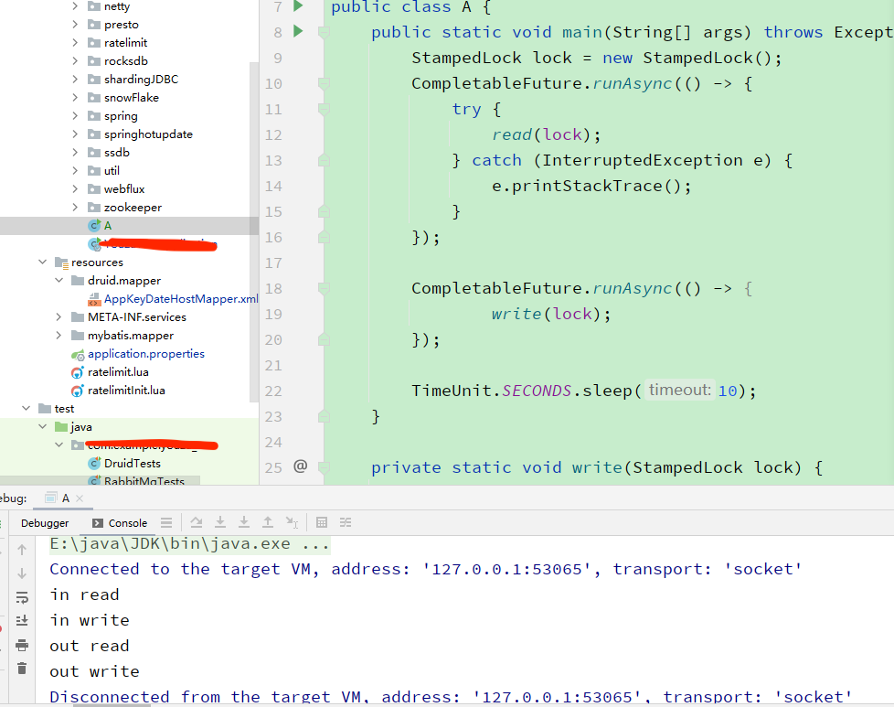
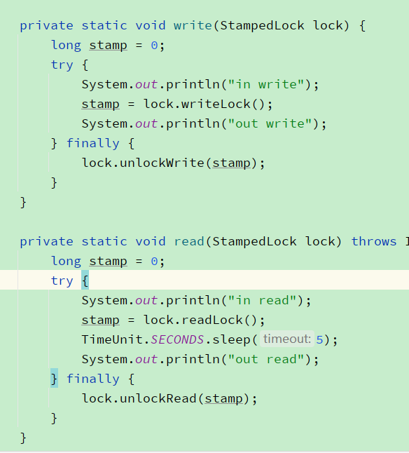
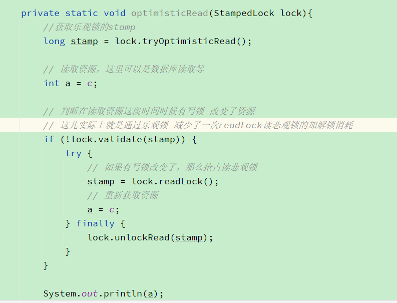

## [美团技术对锁的介绍](https://tech.meituan.com/2018/11/15/java-lock.html)

## 对象头

我们以Hotspot虚拟机为例，Hotspot的对象头主要由以下部分组成

- Mark Word：默认存储对象的HashCode，分代年龄和锁标志位信息。这些信息都是与对象自身定义无关的数据，所以Mark
  Word被设计成一个非固定的数据结构以便在极小的空间内存存储尽量多的数据。它会根据对象的状态复用自己的存储空间，也就是说在运行期间Mark Word里存储的数据会随着锁标志位的变化而变化。
  
- Klass Point：对象指向它的类元数据的指针，虚拟机通过这个指针来确定这个对象是哪个类的实例。
- 对齐填充字节（Padding）：用于确保对象的总长度为 8 字节的整数倍，HotSpot VM 的自动内存管理系统要求对象的大小必须是 8 字节的整数倍。而对象头部分正好是 8 字节的倍数（1 倍或 2
  倍），因此，当对象实例数据部分没有对齐时，就需要通过对齐填充来补全。**对齐填充并不是必然存在，也没有特别的含义，它仅仅起着占位符的作用**

## Monitor

mark word重量级锁指针指向一个monitor（hotspot的monitor实现是ObjectMonitor）
**ObjectMonitor 不仅是重量级锁的实现，还是 Object 的 wait/notify/notifyAll 方法的底层核心实现**

#### **ObjectMonitor 主要组成：**

1. \_count：记录 owner 线程获取锁的次数
2. \_owner：指向持有 ObjectMonitor 对象的线程
3. \_WaitSet：存放处于 wait 状态的线程队列
4. \_EntryList：存放处于等待锁 block 状态的线程队列
5. \_recursions：记录锁的重入次数



#### **ObjectMonitor 实现原理：**

1. JAVA 对象头的 Mark Word 中会存放 ObjectMonitor 的指针，根据该指针可以获取到 ObjectMonitor
2. 线程想要获取 ObjectMonitor 锁时，首先会进入\_EntryList 队列
3. 当某个线程获取到对象的 monitor 后，进入\_Owner 区域，设置为当前线程，同时计数器\_count 加 1
4. 如果线程调用了 wait()方法，则会进入\_WaitSet 队列。它会释放 monitor 锁，即将\_owner 赋值为 null，\_count 自减 1，进入\_WaitSet 队列阻塞等待
5. 如果其他线程调用 notify() / notifyAll() ，会唤醒\_WaitSet 中的某个线程，该线程再次尝试获取 monitor 锁，成功即进入\_Owner 区域
6. 释放监视锁时，线程退出临界区，将 monitor 的 owner 设为 null

## synchronized同步的意思

- **synchronized: 对象级别。** 是针对一个对象上锁，如果直接加在方法上，那么是对this上锁。

- **static synchronized: 就是类级别的锁。** 针对class上锁。

- **锁重入：** 假设a方法调用了b方法，这两个方法持有同一把锁，那么a调b，b是可以执行的。继承也可以用锁重入。

- **同步块和同步方法区别：**
  1、同步块，在块前后会插入monitorenter和monitorexit，这两个命令分别执行上述的+1 -1操作  
  2、同步方法，每个方法有个标识（flag），这个flag会多一个标识 ACC_SYCHRONIZED，JVM通过这个标识就知道这个是一个同步方法，进而执行上述的 +1 -1操作。

- **synchronized状态：**  
  无锁 -> 偏向锁 -> 轻量级锁 -> 重量级锁
    - **无锁：** 刚new出来的对象，现在锁状态就是无锁状态
    - **自旋锁（spinlock）:** 是一种非阻塞锁，也就是说，如果某线程需要获取锁，但该锁已经被其他线程占用时，该线程不会被挂起，而是在不断的消耗CPU的时间，不停的试图获取锁。也是用cas实现的。
    - **自适应自旋锁：**
      会根据前一次在同一个锁上得自旋时间及锁得拥有者状态来决定。如果在同一个锁对象上，自旋线程之前刚刚获得过锁，且现在持有锁的线程正在运行中，那么虚拟机会认为这次自旋也很有可能会成功，进而允许该线程等待持续相对更长的时间，比如100个循环。反之，如果某个锁自旋很少获得过成功，那么之后再获取锁的时候将可能省略掉自旋过程，以避免浪费处理器资源。
    - **锁消除：** jvm会在编译时候，去除没有必要多余的锁，提升代码效率
    - **锁粗化：** 比如循环里有上锁解锁操作，jvm会粗化到循环外
    - **偏向锁：** 如果一个锁只有一个线程用到，并不存在竞争关系，那么markword会记录下来当前线程id，下次这个线程再来的时候就直接运行方法不做锁操作，在markword里记录
    - **轻量级锁：** 轻量级锁是由偏向锁升级而来，当偏向锁运行一个线程进入同步块时候，第二个加入锁竞争，偏向锁就会升级为轻量级锁，它不会阻塞，而是自旋。（自旋几次还没获取到锁升级为重量级锁）,用cas实现自旋锁
    - **重量级锁：** 内核会从用户态转为内核态，用monitor

- **原理**
    - 对象头有个mark word，指向monitor。

    - **monitorenter：**  
      每个对象有一个监视器锁（monitor）。当monitor被占用时就会处于锁定状态，线程执行monitorenter指令时尝试获取monitor的所有权，过程如下：  
      1、如果monitor的进入数为0，则该线程进入monitor，然后将进入数设置为1，该线程即为monitor的所有者。   
      2、如果线程已经占有该monitor，只是重新进入，则进入monitor的进入数加1.  
      3、如果其他线程已经占用了monitor，则该线程进入阻塞状态，直到monitor的进入数为0，再重新尝试获取monitor的所有权。
    - **monitorexit：**  
      执行monitorexit的线程必须是objectref所对应的monitor的所有者。
      指令执行时，monitor的进入数减1，如果减1后进入数为0，那线程退出monitor，不再是这个monitor的所有者。其他被这个monitor阻塞的线程可以尝试去获取这个 monitor 的所有权

---

## wait notify

需要在同步块（synchronized）里使用

### 原理

详见上文 ObjectMonitor 实现原理

---

## LockSupport

[介绍地址](https://www.pdai.tech/md/java/thread/java-thread-x-lock-LockSupport.html)

### 特性

1、他允许先用unpark再用park（wait不行）  
2、Thread.interceptor也会释放锁  
3、他会挂起线程但是不会释放锁（wait会）

### 样例



### 原理

通过调用Unsafe 的 park 和 unpark（CAS 操作）对线程进行阻塞/放行操作  
底层 park 和 unpark 的原理：

```
int _count = 0; //初始值是0
void park(){
  //说明有人调用过unpark，本次park不阻塞 
  // 这个操作主要是用于LockSupport 支持先unpark。如果先unpark，那么park不会阻塞
  if(_count>0){
    _count=0
    return;
  }
  block()
}

void unPark(){
  //说明有人park，唤醒它
  if(_count<1){
    unblock()
  }
    _count=1
}
```

---

## StampedLock解决问题（饥饿问题）：

[介绍地址](https://www.pdai.tech/md/java/java8/java8-stampedlock.html)

### 饥饿问题

虽然ReentrantReadWriteLock有读写锁模式，但是当读并发很高时候，写基本上没法进行

### 样例

StampedLock控制锁有三种模式（写，读，乐观读）  
1、读、写。都属于悲观锁，跟reentrantlock一样  

  
2、乐观读取（OptimisticReading）：提供了tryOptimisticRead方法返回一个非0的stamp，只有当前同步状态没有被写模式所占有是才能获取到。乐观锁读主要解决饥饿问题，原来的悲观锁模式，读并发高时候，往往写不了，但是用了乐观锁，能大大降低悲观写的阻塞。


---

## CountDownLatch（倒数计数器）

[介绍地址](https://www.pdai.tech/md/java/thread/java-thread-x-juc-tool-countdownlatch.html)  
当一个或者多个线程调用await()方法时，调用的线程会被阻塞，其它线程调用countDown()方法时将计数器减去1(调用countDown()方法的线程不会被阻塞)，但计数器的值变为0时，因为调用await()
方法被阻塞的线程会被唤醒，继续执行。

### 例子

```
/**
 * CountDownLatch  类计数器的使用
 * CountDownLatch  主要有两个方法，当一个或者多个线程调用await()方法时，调用线程会被阻塞，
 * 其它线程调用countDown()方法将计数器减 1 (调用countdown()方法的线程不会被阻塞)，
 * 但计数器的值变为零时，因调用await()方法被阻塞的线程会被唤醒，继续执行。
 */
public class CountDownLatchDemo {
    public static void main(String[] args) throws InterruptedException {
        CountDownLatch count = new CountDownLatch(6);
        for (int i = 1; i <= 6; i++) {
            new Thread(() -> {
                System.out.println(Thread.currentThread().getName() + "\t 国，被灭");
                count.countDown();//逐个减一，只有所有的线程执行完成，才会执行下面的代码(倒计数 )
            }, CountDownLatchEnum.getMessenger(i).getRetMessenger()).start();
        }
        count.await();//判断上面的线程是否执行完成，若未完成；则返回上面继续执行，直到上面的线程执行完成，才会执行下面的代码
        System.out.println(Thread.currentThread().getName().replaceAll("main","秦") + "\t 国，统一六国");
    }
}
```

### 原理

- CountDownLatch 基于 AQS 实现，允许一个或者多个线程一直等待，直到一组其它操作执行完成，采用 AQS 的共享模式实现，await 时执行 CAS 后加入到同步队列并执行 LockSupport 的
  park，countDown 时执行 CAS，直到 state=0 时执行 LockSupport 的 unpark 方法
- 需要指定一个整数值，此值是线程将要等待的操作数。当某个线程为了要执行这些操作而等待时，需要调用 await 方法。await 方法让线程进入休眠状态直到所有等待的操作完成为止。当等待的某个操作执行完成，它使用 countDown
  方法来减少 CountDownLatch 类的内部计数器。当内部计数器递减为 0 时，CountDownLatch 会唤醒所有调用 await 方法而休眠的线程们

---

## CyclicBarrier（循环屏障）

[介绍地址](https://www.pdai.tech/md/java/thread/java-thread-x-juc-tool-cyclicbarrier.html)  
多个线程执行，等都到达await了，会取其中一条线程执行CyclicBarrier的自定义的runnable方法  (如果你有设置的话)

### 样例

```
public class CyclicBarrierDemo {

    static class TaskThread extends Thread {
        
        CyclicBarrier barrier;
        
        public TaskThread(CyclicBarrier barrier) {
            this.barrier = barrier;
        }
        
        @Override
        public void run() {
            try {
                Thread.sleep(1000);
                System.out.println(getName() + " 到达栅栏 A");
                barrier.await();
                System.out.println(getName() + " 冲破栅栏 A");
                
                Thread.sleep(2000);
                System.out.println(getName() + " 到达栅栏 B");
                barrier.await();
                System.out.println(getName() + " 冲破栅栏 B");
            } catch (Exception e) {
                e.printStackTrace();
            }
        }
    }
    
    public static void main(String[] args) {
        int threadNum = 5;
        CyclicBarrier barrier = new CyclicBarrier(threadNum, new Runnable() {
            
            @Override
            public void run() {
                System.out.println(Thread.currentThread().getName() + " 完成最后任务");
            }
        });
        
        for(int i = 0; i < threadNum; i++) {
            new TaskThread(barrier).start();
        }
    }
}

结果：
Thread-1 到达栅栏 A
Thread-3 到达栅栏 A
Thread-0 到达栅栏 A
Thread-4 到达栅栏 A
Thread-2 到达栅栏 A
Thread-2 完成最后任务
Thread-2 冲破栅栏 A
Thread-1 冲破栅栏 A
Thread-3 冲破栅栏 A
Thread-4 冲破栅栏 A
Thread-0 冲破栅栏 A
Thread-4 到达栅栏 B
Thread-0 到达栅栏 B
Thread-3 到达栅栏 B
Thread-2 到达栅栏 B
Thread-1 到达栅栏 B
Thread-1 完成最后任务
Thread-1 冲破栅栏 B
Thread-0 冲破栅栏 B
Thread-4 冲破栅栏 B
Thread-2 冲破栅栏 B
Thread-3 冲破栅栏 B
```

### 原理

- CyclicBarrier 基于 ReentrantLock的condition实现，控制多个线程执行自有操作后一直等待，所有的线程必须等待对方，直到所有的线程到达屏障，然后继续运行，是用来协同多线程一起工作的
- CyclicBarrier 维护了一个 count，表示总线程数，调用 dowait 方法时，先将 count 减一，使用 ReentrantLock 确保 count 的计数准确，再判断 count=0
- 如果 count=0，signalAll所有线程，并重新初始化循环屏障（所以 CyclicBarrier 可以重用）
- 如果 count 不等于 0，await进行等待

### CyclicBarrier跟CountDownLatch区别

1、CountDownLatch只能用一次，CyclicBarrier可以在循环使用（循环屏障嘛，可以循环的）。PS：网上基本上大多说reset可以重置，所以才能循环使用，准确来说CyclicBarrier天生就是可循环的，这个reset是说你有线程在wait，这时候你reset可以让等待的线程报错退出的意思。
2、CountDownLatch会卡主主线程，CyclicBarrier只会卡主子线程  
3、当然以上都是百度得到的，最后一点我想说说我个人平时工作中使用的区别。

-
CountDownLatch：之前写过一个游戏发货系统，这个系统要支持一笔订单的不同商品用不同发货方式，比如有些是发送到玩家邮箱，有些要发送到账号里，但是同一笔单子要所有东西都发送完才进行下一步（比如记录啊啥的），这里每个不同发放方式都用一个线程跑，主线程await
- CyclicBarrier： 这个是当时自测一个接口并发的情况。但是这个接口的入参可能需要用代码生成，为了尽可能接近并发用了这个类。所有线程都wait等到数据都准备好了，一起访问。

---

## Phaser（阶段）

[介绍地址1](https://www.pdai.tech/md/java/thread/java-thread-x-juc-tool-phaser.html)

Phaser 是 JDK 7 新增的一个同步辅助类，它可以实现 CyclicBarrier 和 CountDownLatch 类似的功能，而且它支持count的动态调整，并支持分层结构来实现多线程多阶段执行

---

## Semaphore（信号量）

[介绍地址](https://www.pdai.tech/md/java/thread/java-thread-x-juc-tool-phaser.html)

### 原理

* 基于 AQS 实现，用 state 来保存信号量的令牌数。release方法 会增加令牌数，acquire方法 会减少令牌数，当令牌数不足时候阻塞。有公平策略和非公平策略两种实现方式

---

## Exchanger（线程数据交换器）

* Exchanger 用于两个线程之间的数据交换（只能同步两个线程）。它提供一个同步点，在这个同步点，两个线程可以交换彼此的数据。这两个线程通过 exchange()方法交换数据，当一个线程先执行 exchange()
  方法后，它会一直等待第二个线程也执行 exchange()方法，当这两个线程到达同步点时，这两个线程就可以交换数据了
* 在 JDK5 中 Exchanger 被设计成一个容量为 1 的容器，存放一个等待线程，直到有另外线程到来就会发生数据交换，然后清空容器，等到下一个到来的线程
* 从 JDK6 开始，Exchanger 用了类似 ConcurrentMap 的分段思想，提供了多个 slot，增加了并发执行时的吞吐量

### 样例

```
public class Test {
static class Producer extends Thread {
    private Exchanger<Integer> exchanger;
    private static int data = 0;

    Producer(String name, Exchanger<Integer> exchanger) {
        super("Producer-" + name);
        this.exchanger = exchanger;
    }

    @Override
    public void run() {
        for (int i=1; i<5; i++) {
            try {
                TimeUnit.SECONDS.sleep(1);
                data = i;
                System.out.println(getName()+" 交换前:" + data);
                data = exchanger.exchange(data);
                System.out.println(getName()+" 交换后:" + data);
            } catch (InterruptedException e) {
                e.printStackTrace();
            }
        }
    }
}

static class Consumer extends Thread {
    private Exchanger<Integer> exchanger;
    private static int data = 0;

    Consumer(String name, Exchanger<Integer> exchanger) {
        super("Consumer-" + name);
        this.exchanger = exchanger;
    }

    @Override
    public void run() {
        while (true) {
            data = 0;
            System.out.println(getName()+" 交换前:" + data);
                try {
                    TimeUnit.SECONDS.sleep(1);
                    data = exchanger.exchange(data);
                } catch (InterruptedException e) {
                    e.printStackTrace();
                }
            System.out.println(getName()+" 交换后:" + data);
            }
        }
    }
    
    public static void main(String[] args) throws InterruptedException {
        Exchanger<Integer> exchanger = new Exchanger<Integer>();
        new Producer("", exchanger).start();
        new Consumer("", exchanger).start();
        TimeUnit.SECONDS.sleep(7);
        System.exit(-1);
    }
}

输出结果：
Consumer- 交换前:0
Producer- 交换前:1
Consumer- 交换后:1
Consumer- 交换前:0
Producer- 交换后:0
Producer- 交换前:2
Producer- 交换后:0
Consumer- 交换后:2
Consumer- 交换前:0
Producer- 交换前:3
Producer- 交换后:0
Consumer- 交换后:3
Consumer- 交换前:0
Producer- 交换前:4
Producer- 交换后:0
Consumer- 交换后:4
Consumer- 交换前:0
```

---

## reentrantlock

公平锁：这个是reentrantlock才有的，Lock lock = new ReentrantLock(true); 意思是把锁给等待时间最久的线程。（理解意思就好，慎用）

### condition

跟wait和notify差不多  
wait和notify必须要在同步块里，condition必须在lock里；  
wait会释放锁，condition.await也会释放锁；

### 原理：

cas+aqs。以上锁为例，他跟synchronized一样有个valatile的state，利用cas进行加减，当另一个线程获取到state!=0那么进入aqs的队列。

### 例子

```
1、重入锁reentrantlock（基本跟synchronized一样）；
        Lock lock = new ReentrantLock();
          public void A(){
              lock.lock();
              try{
                    ... 
              }catch(){
              }finally{
                   lock.unlock(); 
              }
          } 
2、condition
          Lock lock = new ReentrantLock();
          Condition condition = lock.newCondition();
          public void A(){
              lock.lock();
              try{
                    ... 
                    condition.await();      //相当于     Object的wait();
                    condition.signal();      //相当于     Object的notify();
                    condition.signalAll();      //相当于     Object的notifyAll();  唤醒所有使用该condition的线程
              }catch(){
              }finally{
                   lock.unlock(); 
              }
          } 

3、读写锁：reentrantreadwritelock
          ReenTrantReadWriteLock rwLock = new ReenTrantReadWriteLock();
          ReadLock readLock = rwLock.readLock();
          WriteLock write Lock = rwLock.writeLock();
```

读写锁意思就是：读读共享，读写互斥，写写互斥。意思是如果两个方法都是调用读锁，那么多线程可以并发访问。但是一个方法调用读方法，一个调用写方法，那么该锁就会变成同步锁（一个方法完了才去执行另一个）。

---

## 区别

### synchronized和lock区别

* synchronized是关键字，lock是一个工具集合

### Object.wait和Condition.await区别

* notifyall无法控制唤醒wait的执行顺序，但是lock可以new多个condition，也就是说可以用condition唤醒你要唤醒的await

### Thread.sleep()和 Object.wait()的区别

* Thread.sleep()不会释放占有的锁，Object.wait()会释放占有的锁
* Thread.sleep()必须传入时间，Object.wait()可传可不传，不传表示一直阻塞下去
* Thread.sleep()到时间了会自动唤醒，然后继续执行
* Object.wait()不带时间的，需要另一个线程使用 Object.notify()唤醒
* Object.wait()带时间的，假如没有被 notify，到时间了会自动唤醒，这时又分好两种情况，一是立即获取到了锁，线程自然会继续执行；二是没有立即获取锁，线程进入同步队列等待获取锁

### Thread.sleep()和 Condition.await()的区别

* Object.wait()和 Condition.await()的原理是基本一致的，不同的是 Condition.await()底层是调用 LockSupport.park()来实现阻塞当前线程的

### Thread.sleep()和 LockSupport.park()的区别

* 从功能上来说，Thread.sleep()和 LockSupport.park()方法类似，都是阻塞当前线程的执行，且都不会释放当前线程占有的锁资源； Thread.sleep()没法从外部唤醒，只能自己醒过来
* LockSupport.park()方法可以被另一个线程调用 LockSupport.unpark()方法唤醒
* Thread.sleep()方法声明上抛出了 InterruptedException 中断异常，所以调用者需要捕获这个异常或者再抛出； LockSupport.park()方法不需要捕获中断异常
* Thread.sleep()本身就是一个 native 方法； LockSupport.park()底层是调用的 Unsafe 的 native 方法

### Object.wait()和 LockSupport.park()的区别

* Object.wait()方法需要在 synchronized 块中执行； LockSupport.park()可以在任意地方执行
* Object.wait()方法声明抛出了中断异常，调用者需要捕获或者再抛出
* LockSupport.park()不需要捕获中断异常
* Object.wait()不带超时的，需要另一个线程执行 notify()来唤醒，但不一定继续执行后续内容
* LockSupport.park()不带超时的，需要另一个线程执行 unpark()来唤醒，一定会继续执行后续内容
* 如果在 wait()之前执行了 notify()会怎样? 抛出 IllegalMonitorStateException 异常
* 如果在 park()之前执行了 unpark()会怎样? 线程不会被阻塞，直接跳过 park()，继续执行后续内容