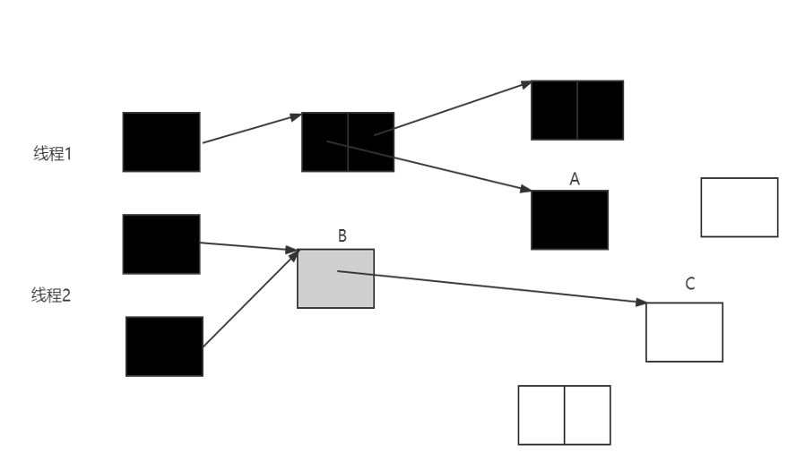
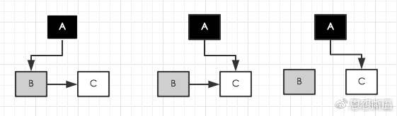
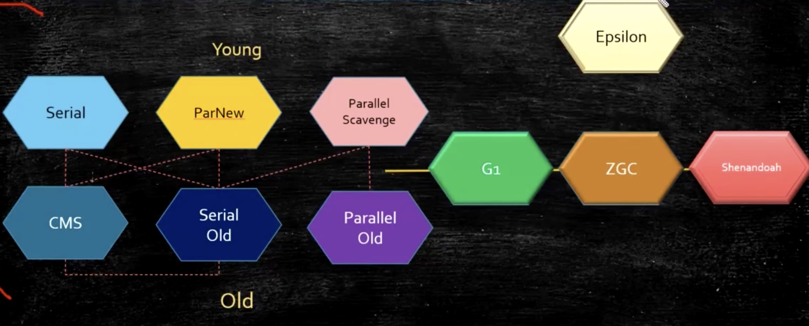
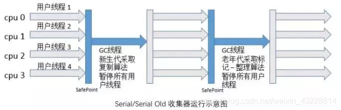
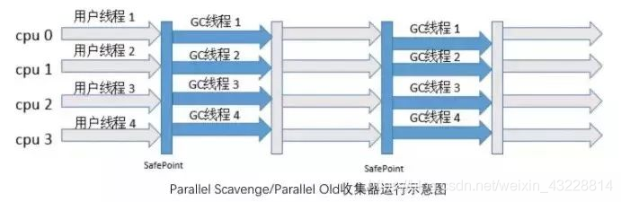
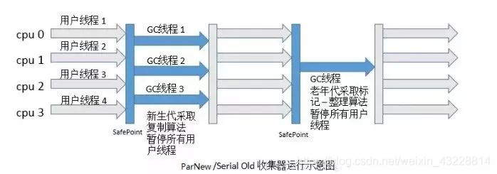
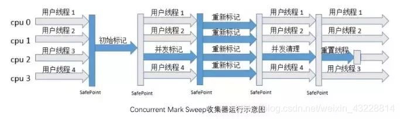
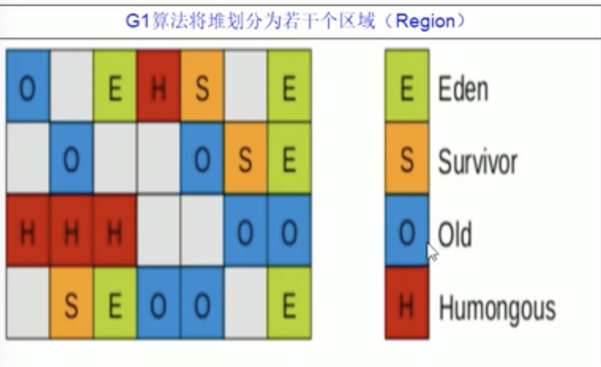
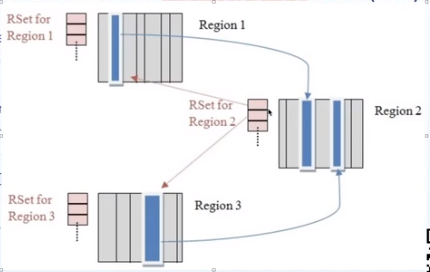
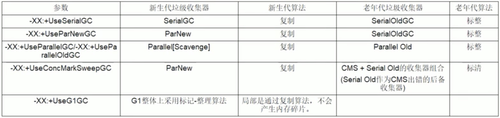

# GC分类

JVM在进行GC时，可能针对三个区域进行垃圾回收分别是新生代、老年代、元空间，大部分时候回收的都是新生代。GC类型主要有以下四种类型。

### 新生代收集（Minor GC/Young GC）

* 只针对新生代的垃圾收集。**会STW**
* 触发条件：eden区满

### 老年代收集（Major GC/Old GC）

* 只针对 老年代的垃圾收集。 目前，只有CMS收集器会有单独收集老年代的行为。

### 混合收集（Mixed GC）

* 指目标是收集整个新生代以及部分老年代的垃圾收集。 目前只有G1收集器会有这种行为。

### 整堆收集（Full GC）

* 收集整个Java堆和元空间的垃圾收集。
* 触发条件  
  1、如果老年代没有足够空间的话，那么就会进行一次 Full GC。  
  2、担保失败  
  3、system.gc()  
  4、元空间内存达到阈值
* 担保机制（**默认开启**）  
  只要老年代的连续空间大于新生代对象总大小或者历次晋升的平均大小，就会进行 Minor GC，否则将进行 Full GC

---

# 垃圾回收算法

### 标记清除算法

- 标记的过程：遍历所有的 GC Roots，然后将所有 GC Roots 可达的对象标记为存活的对象
- 清除的过程：遍历堆中所有的对象，将没有标记的对象全部清除掉。与此同时，清除那些被标记过的对象的标记，以便下次的垃圾回收 缺点：
- 效率问题：标记和清除两个过程的效率都不高
- 空间问题：标记清除之后会产生大量不连续的内存碎片，碎片太多可能导致以后需要分配较大对象时，无法找到足够的连续内存而不得不提前触发另一次垃圾收集动作

### 复制算法（新生代）

- 将可用内存按容量划分为大小相等的两块，每次只使用其中的一块。当这一块内存用完，需要进行垃圾收集时，就将存活者的对象复制到另一块上面，然后将第一块内存全部清除
- 缺点：内存缩小为原来的一半，浪费空间
- 优点：不会有内存碎片的问题
- 为了解决空间利用率问题，可以将内存分为三块： Eden、From Survivor、To Survivor，比例是 8:1:1，每次使用 Eden 和其中一块 Survivor。回收时，将 Eden 和 Survivor
  中还存活的对象一次性复制到另外一块 Survivor 空间上，最后清理掉 Eden 和刚才使用的 Survivor 空间。这样只有 10% 的内存被浪费
- 但是我们无法保证每次回收都只有不多于 10% 的对象存活，当 Survivor 空间不够，需要依赖其他内存（指老年代）进行分配担保
    - 为对象分配内存空间时，如果 Eden+Survivor 中空闲区域无法装下该对象，会触发 MinorGC 进行垃圾收集。但如果 Minor GC 过后依然有超过 10%
      的对象存活，这样存活的对象直接通过分配担保机制进入老年代，然后再将新对象存入 Eden 区

### 标记整理算法（老年代）

- 标记：它的第一个阶段与标记/清除算法是一模一样的，均是遍历 GC Roots，然后将存活的对象标记
- 整理：移动所有存活的对象，且按照内存地址次序依次排列，然后将末端内存地址以后的内存全部回收。因此，第二阶段才称为整理阶段
- 这是一种老年代的垃圾收集算法。老年代的对象一般寿命比较长，因此每次垃圾回收会有大量对象存活，如果采用复制算法，每次需要复制大量存活的对象，效率很低

---

# 可达性分析法&引用计数法

## 引用计数法

- 在对象头维护着一个 counter 计数器，对象被引用一次则计数器 +1；若引用失效则计数器 -1。当计数器为 0 时，就认为该对象无效
- 缺陷：如果两个对象相互引用，引用计数法会判定这两个对象还在使用，所占用的内存将无法回收，造成内存泄露
- 目前python用这个，java用可达性分析法

## 可达性分析法

通过一系列称为“GC Roots”的对象作为起始点，从这些节点开始向下搜索，搜索走过的路径称为“引用链”，当一个对象到 GC Roots 没有任何的引用链相连时(从 GC Roots 到这个对象不可达)时，证明此对象不可用。

### 可作为GCRoot对象

- 局部变量
- 静态变量、常量
- native方法引用的对象

---

# 三色标记法

**适用于并发标记，也就是cms和g1**

- 黑色：根、本身和成员变量都扫描完了
- 灰色：本身扫描完了，但是成员变量还没扫描
- 白色：未被扫描

* **三色标记法漏标问题**  
    
  漏标只有同时满足以下两个条件时才会发生：    
  条件一：灰色对象 断开了 白色对象的引用；即灰色对象 原来成员变量的引用 发生了变化。  
  条件二：黑色对象 重新引用了 该白色对象；即黑色对象 成员变量增加了 新的引用。

* **三色标记法漏标问题解决方法**  
  2个解决方式不同CMS在A->C时候处理， G1在B->C时候处理  
  CMS: 写屏障 + incremental update（增量更新）：执行A -> C时，用写屏障，把A变成灰色（incremental update，就是增加扫描的意思）。
  注意这里是从根节点开始扫描而不是从A   
  G1: 写屏障 + SATB：执行B -> C时，用写屏障，把C记入到一个队列里，以C为根对象重新扫描。所以可能出现浮动垃圾

* 写屏障 跟aop差不多，只是在要执行的代码结构前后加一些代码。不过这里要说一下这儿的写屏障跟内存屏障里的写屏障不是一回事。

---

# 垃圾回收器

（并行：多个线程一起GC，但是还是会卡住用户线程。并发：GC和用户线程会一起执行）

**Serial/serial Old（串行）**：单个线程，GC时候会停止用户线程，不是和任何服务器环境

**Parallel/parallelOld（并行）**：多个线程，serial多线程版本。GC时候会停止用户线程，用于大数据计算，注重吞吐量（代码运行时间=（总时间-GC时间）/总时间），与前台交互不多的后台计算。  

**parNew**：多个线程，原理跟parallel差不多，但是这个适合追求低停顿的交互场景

**Cms（并发，ConcMarkSweep）**：GC与用户线程并发执行，适用于互联网环境，仅仅是在标记时候短暂STW，其余时间都是和用户线程并发执行。缺点：CPU压力大，有内存碎片（因为它使用标清算法）  

* 过程
    * 初始标记：Stop The World，仅使用一条初始标记线程从垃圾回收的"根对象"开始，只扫描到能够和"根对象"直接关联的对象，并作标记(该标记并不是三色标记，只是对象头里gc标志位)。
    * 并发标记：使用多条标记线程，与用户线程并发执行。标记出所有存活对象。速度很慢。（三色标记）
    * 重新标记：Stop The World，使用多条标记线程并发执行，因为刚才并发标记过程中可能引用关系发生变化（注意这里不是解决浮动垃圾，而是解决漏标）。
    * 并发清除：只使用一条 GC 线程，与用户线程并发执行，清除刚才标记的对象。这个过程非常耗时。
* 缺点
    * 吞吐量低
    * 无法处理浮动垃圾，导致频繁 Full GC
    * 使用“标记-清除”算法产生碎片空间
    * 退化
        * 并发模式失败（Concurrent Mode Failure）：CMS GC 运行期间，同时又有 Young GC 晋升的对象要放入到了 Old 区中，而此时 Old 区空间不足造成的
* 浮动垃圾
    * 因为第二次标记是和用户线程并行的，因此用户线程可能会随时对一个标记为可达的对象进行修改成不可达，例如a引用了b，此时b被扫描为可达，但是用户线程之后对a.b=null，这个时候b依然作为可达的，因此就成了浮动垃圾。

**G1**：把堆内存分割成小块，并发的执行。 优点(也是回答了G1跟cms区别)：不会产生内存碎片，用户可以指定停顿时间（-XX:MaxGCPauseMillis）

**注：humongous是超大对象放的地方，超大对象是指超过region一半**

* 过程
    * **young gc** 只回收全部新生代，原理是复制算法（多线程并发）。当eden满了就触发。
    * **mixed gc（最重要）**
      回收全部新生代和部分老年代，原理类似cms，用到Rset和cardtable。它主要是全部的新生代，以及垃圾最多的老年代（这也是G1名字的由来）来进行回收。当达到阈值（默认已使用的内存到达45%）就会触发mixed gc。
        * 初始标记：Stop The World，仅使用一条初始标记线程对所有与 GC Roots 直接关联的对象进行标记。会进行一次ygc，而且借用ygc时候的标记，所以很快
        * 并发标记：使用一条标记线程与用户线程并发执行。速度很慢。等都标记完还要重新处理一下SATB记录下的在并发时有引用改变的对象（三色标记）
        * 最终标记：Stop The World，使用多条标记线程并行执行。处理并发标记结束后仍遗留下来的少量的SATB记录
        * 筛选回收：Stop The World，回收废弃对象，并使用多条筛选回收线程并发执行。
    * **full gc** 触发条件和cms差不多，也是并发回收失败会进行fullgc，退化成serial old gc

* 为啥G1可以控制垃圾回收时间  
  在mix gc的第四点（筛选回收）他会根据用户设置的时间长短（默认200ms），以及垃圾多少，选择性回收

* cardtable & rememberset（rset）
  这两个数据结构是专门用来处理Old区到Young区的引用。(跨代引用) 这样gc时候就不需要去扫描老年代

    * **cardtable(不是g1专属，cms也有)**
      ：把老年代划分成以512byte大小的card，cardtable是个byte数组，每个card都对应cardtable的一个位置。当出现老年代对象指向新生代对象时候，把老年代对象所在的card所对应的cardtable位置标志为dirty（这儿使用写屏障来设置dirty）。这样young
      gc只要扫描dirty卡里的对象，而不用整个老年代扫描。
    * **rset(remember set，只有g1有)**:
      每个region还有个rset，用来记录region被哪个card引用。例如下图Region1中的一个card引用了Region2，那么Region2的Rset就会记录Region1的这个card（写屏障）
    * **总结**  
      ①为啥需要cardtable和rset：因为标记是从新生代到老年代的，新生代的引用了老年代没问题，但是老年代引用了年轻代的对象就有问题，称为跨代引用。用这两个配合，我们只要去扫描rset里的card即可，而不必全盘扫描  
      ②为啥不直接用cardtable，还要加一个rset：因为G1之前老年代都是连续的，所以只要从老年代开始加上偏移量（偏移量是cardtable的index *
      512）就可以了。但是G1的老年代是一块一块的，所以需要类型rset（hash结构，key是region的起始地址， value是card下标，如下图的rset k为region1的开始地址，v为蓝色那张card的下标）。  
      

垃圾收集器7个分4组：1 serial+serialold 2 parnew + cms 3 parallel + parallelold 4 G1

