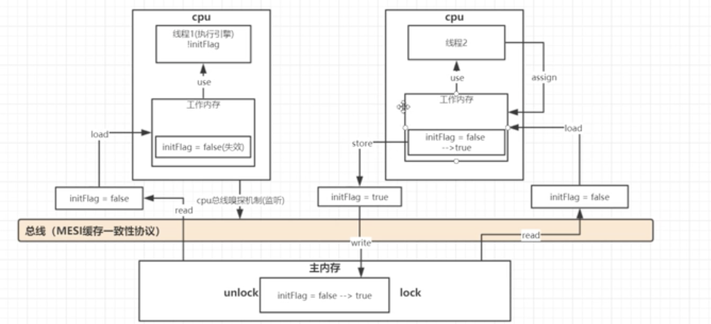
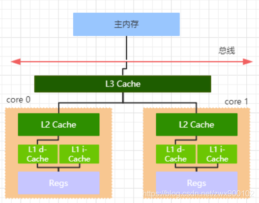

# jmm(java内存模型)

## happen-before

在JMM中，如果一个操作执行的结果需要对另一个操作可见，那么这两个操作之间必须要存在happens-before关系

1. 单线程 happen-before 原则：在同一个线程中，书写在前面的操作 happen-before 后面的操作
2. 锁的 happen-before 原则：同一个锁的 unlock 操作 happen-before 此锁的 lock 操作
3. volatile 的 happen-before 原则：对一个 volatile 变量的写操作 happen-before 对此变量的任意操作(当然也包括写操作了)
4. happen-before 的传递性原则：如果 A 操作 happen-before B 操作，B 操作 happen-before C 操作，那么 A 操作 happen-before C 操作
5. 线程启动的 happen-before 原则：同一个线程的 start 方法 happen-before 此线程的其它方法
6. 线程中断的 happen-before 原则：对线程 interrupt 方法的调用 happen-before 被中断线程的检测到中断发送的代码
7. 线程终结的 happen-before 原则：线程中的所有操作都 happen-before 线程的终止检测
8. 对象创建的 happen-before 原则：一个对象的初始化完成先于他的 finalize 方法调用

总结：一个操作“时间上的先发生”不代表这个操作先行发生；一个操作先行发生也不代表这个操作在时间上是先发生的（重排序的出现）。时间上的先后顺序对先行发生没有太大的关系，所以衡量并发安全问题的时候不要受到时间顺序的影响，一切以先行发生原则为准。

## volatile

volatile并不是说线程直接读取主内存的值，而是当一个线程修改了工作内存的值，它会立即同步到主内存（没有用这个关键字并不是立即同步，而是看CPU），然后cpu总线嗅探机制会让其他核（线程)
的工作内存里的值失效，这样就可以重新去主内存拉取最新值  
主内存：内存条  
工作内存：cpu寄存器或者高速缓存  

### 嗅探机制工作原理

每个处理器通过监听在总线上传播的数据来检查自己的缓存值是不是过期了，如果处理器发现自己缓存行对应的内存地址修改，就会将当前处理器的缓存行设置无效状态，当处理器对这个数据进行修改操作的时候，会重新从主内存中把数据读到处理器缓存中。

### 总线风暴

如果用了太多volatile，会不断嗅探（cas）总线导致总线带宽达到峰值。

### 伪共享：

这里一、二、三级缓存都是由缓存行组成，一个缓存行是64byte大小。伪共享的意思是，一个缓存行存多个属性，但是cpu都是以缓存行为单位执行的，这时候由于总线嗅探机制，会导致一个缓存行数据都失效，即使这个缓存行里只有一个属性有变化。解决方法：用@Contended注解，这个注解会自动为属性填充，使一个缓存行只有一个属性

PS: 寄存器和一级二级缓存都在cpu里，三级在外面  

### 指令重排

在执行程序时，为了提高性能，编译器和处理器会对指令做重排序：

1. 编译器优化重排序：编译器在不改变单线程程序语义的前提下，可以重新安排语句的执行顺序
2. 指令级并行的重排序：如果不存在数据依赖性，处理器可以改变语句对应机器指令的执行顺序
3. 内存系统的重排序：处理器使用缓存和读写缓冲区，这使得加载和存储操作看上去可能是在乱序执行

#### as-if-serial

- 不管怎么重排序（编译器和处理器为了提高并行度），（单线程）程序的执行结果不会改变

**可以通过插入特定类型的 Memory Barrier 来禁止特定类型的编译器重排序和处理器重排序**

### 内存屏障

**内存屏障，又称内存栅栏，是一个 CPU 指令，作用：**

1. 保证特定操作的执行顺序
2. **影响某些数据（或则是某条指令的执行结果）的内存可见性，使数据对其他 CPU 变得可见（指刷新到主内存），读取时也只能从主内存加载最新的值**

**java 内存模型 volatile 是基于 Memory Barrier 实现的**

#### volatile语义中的内存屏障

* volatile的内存屏障策略非常严格保守，非常悲观且毫无安全感的心态：

在每个volatile写操作前插入StoreStore屏障，在写操作后插入StoreLoad屏障；在每个volatile读操作前插入LoadLoad屏障，在读操作后插入LoadStore屏障；

* 内存屏障的作用，避免了volatile变量和其它指令重排序(作用1)、线程之间实现了通信(作用2)，使得volatile表现出了锁的特性。

