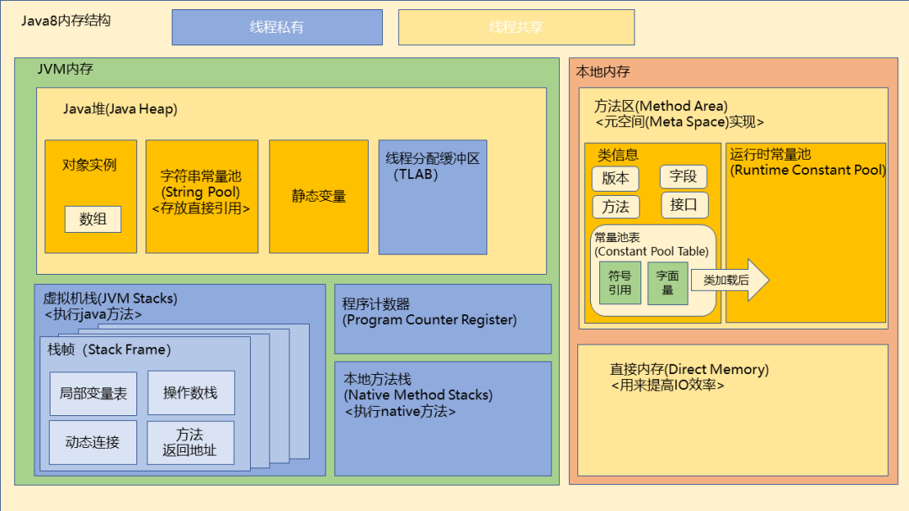
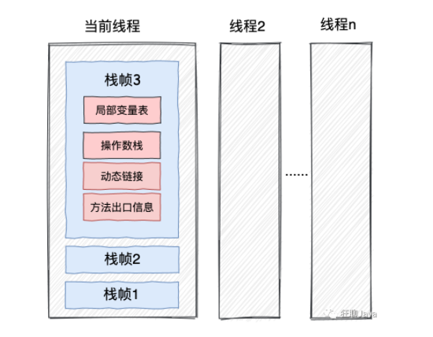
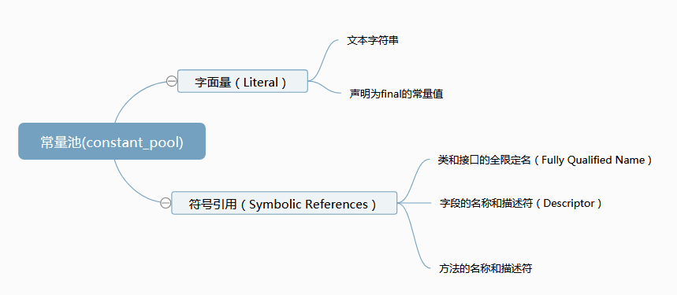

```
以下均以jdk8为例
```

# jvm内存模型



## 一、运行时数据区(指的就是上图绿色框的部分)

### 堆

① 对象：我们最常见的 new xxx 就是存在这，包括成员变量及其引用  
② 静态变量：static 标注的成员变量，存在class对象里（PS：final不改变位置，原来是在哪，加了final还是在哪）  
③ 字符串常量池

  ```
  String a = "abc";
  String b = "abc";
  String c = new String("abc");
  String d = new String("abc");
  
  a == b true
  b == c false
  c == d false
  ``` 

字符串分为字面量对象创建和字符串对象创建

- **字面量对象创建**：判断如果字符串常量池有直接返回，否则创建后返回。注意这里创建的是字面量这个对象（如例子中的"abc"这个对象）
- **字符串对象创建**：还是先判断字符串常量池有没有，没有就创建，然后在堆里创建对象（如例子中的 new String("abc")对象）

字面量对象和字符串对象转换

```
String a = "abc";
String b = new String("abc");

a == b false
a == b.intern() true
```

- inter()方法就是返回常量池里的字面量对象

### 栈

它类似一个stack结构，一层一层栈帧组成，每一个方法都是一个栈帧，每一个线程都有一个工作栈，然后栈帧压入工作栈，所以递归时候很容易栈溢出就是因为栈太深了  
  
① 局部变量：如果是基本类型直接保存在栈里，如果是引用对象，引用在栈里，对象在堆里  
② 方法返回地址

### 本地方法栈

native方法

### 程序计数器

就是记录每一行命令的行号。比如时间片跳来跳去，跳回来时候还能知道之前线程执行到哪一行

## 二、本地内存

### 元空间

* **类元信息**：在类编译期间放入方法区，里面放置了类的基本信息，包括类的版本、字段、方法、接口以及常量池表（Constant Pool Table）
    * **常量池表**（Constant Pool Table）存储了类在编译期间生成的字面量、符号引用，这些信息在类加载完后会被解析到运行时常量池中
    * **字面量：** String a = "abc" 这个abc就是字面量
    * **符号引用：** 虚拟机在编译时候并不知道所引用类的地址，所以只能用符号引用代替，在类加载解析阶段会把符号引用替换成直接引用
      例子：org.simple.People.java文件引用org.simple.Language类，但编译时并不知道Language的实际内存地址，只能使用符号org.simple.Language来代替类的内存地址  
      
    * **直接引用**：就是指向具体内存地址
* **运行时常量池**：用来存放编译期生成的各种字面量和符号引用，这部分内容在类加载后进入该常量池中

### 直接内存

也叫堆外内存，很多人以为堆外内存就是堆以外内存，是错的，堆以外内存叫非堆内存