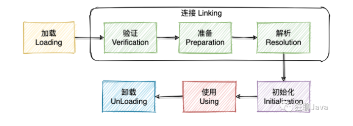
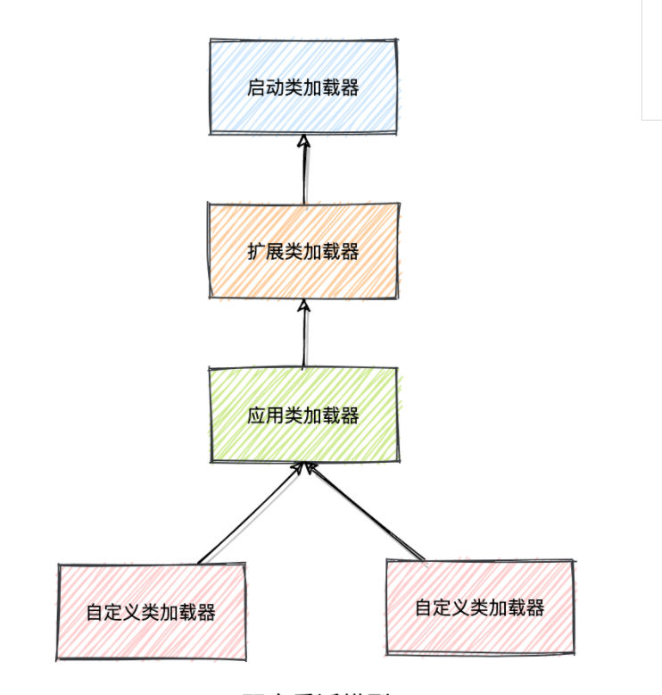

# 类加载机制
JVM 运行时，java 虚拟机会把 Class 文件加载到内存，并对数据进行校验、转换、解析和初始化，最终形成可以被 jvm 可以直接使用的类型，这就是类加载机制。  

## 加载
1. 它是 Java 将字节码(jar 包)数据从不同的数据源读取到 JVM 中，并映射为 JVM 认可的数据结构（Class 对象），
2. 重点：加载阶段是用户参与的阶段，我们可以自定义类加载器，去实现自己的类加载过程。
3. 通过字节流将类的.class 文件中的二进制数据读入到内存。然后在**堆中创建 java.lang.class 对象**，用来封装类在方法区的数据结构
4. 只会创建一个 Class 对象，该 Class 对象来描述有哪些构造方法，都有哪些成员变量

## 验证
① 验证  
验证合法性

② 准备
> 1. 创建类或接口中的静态变量，并初始化静态变量的初始值。
> 2. 但这里的“初始化”和下面的显式初始化阶段是有区别的，
> 3. 测重点在于分配需要的内存空间，不会去执行更进一步的 JVM 指令  

这里的初始化是指：  
1、8 种基本数据类型的默认初始值是 0。  
2、引用类型默认的初始值是 null。  
3、对于有 static final 修饰的常量会直接赋值，例如：static final int x=123；则 x 直接会初始化为 123。

③ 解析  
把运行时常量区的符号引用转为直接引用（这两个区别，见jvm内存模型）

## 初始化
给静态变量初始化。静态块执行。成员变量初始化，普通块执行，构造函数执行

# 类加载器

- 启动类加载器：负责加载环境变量下 jre/lib 下面的 jar 文件
- 扩展类加载器：负责加载环境变量下 jre/lib/ext 目录下面的 jar 包
- 应用类加载器：就是加载我们熟悉的 classpath 的内容
- 自定义加载器：继承 ClassLoader 就可以实现

## 双亲委派
- **概念**：要加载一个Class对象（类），会从自定义类加载器开始往上，看这个加载器是否有加载过，如果没有就委派给上一级父类加载器。依次类推  
- **好处**：双亲委派机制保证了java源代码不会受到我们书写代码的污染，也就说如果你自己写了一个类叫String，但是在java类库也有这么一个类那么你这个类是无法被加载到的。
         我们加载自己写的java.lang.Object时,会默认调用Appliation ClassLoader,这是系统提供的类加载器,肯定支持”双亲委派模型”,所以我们的请求会一步步提交到Bootstrap ClassLoader那里,这个类默认加载的类位于$JAVA_HOME/jre/lib下面的rt.jar包,可以找到我们需要的java.lang.Object类,所以加载的自然就不是我们自己写的Object类了.

### 破坏双亲委派
SPI。  
可见性原则允许子类加载器查看父ClassLoader加载的所有类，但父类加载器看不到子类加载器的类。

java.sql.DriverManager通过扫包的方式拿到指定的实现类，完成 DriverManager的初始化。
但是，根据可见性原则，java.sql.DriverManager是启动类加载器负责的，根据双亲委派的可见性原则，启动类加载器加载的 DriverManager 是不可能拿到系统应用类加载器加载的实现类 。
为了解决这个困境，Java的设计团队只好引入了一个不太优雅的设计：线程上下文类加载器 （Thread Context ClassLoader）。
这个类加载器可以通过java.lang.Thread类的setContext-ClassLoader()方法进行设置，如果创建线程时还未设置，它将会从父线程中继承一个，如果在应用程序的全局范围内都没有设置过的话，那这个类加载器默认就是应用程序类加载器。
通过这个类加载器可以实现功能，但也正是因为如此，双亲委派模型的可见性原则就被破坏了

