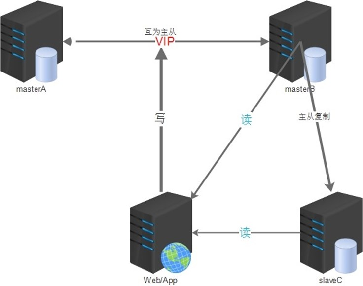
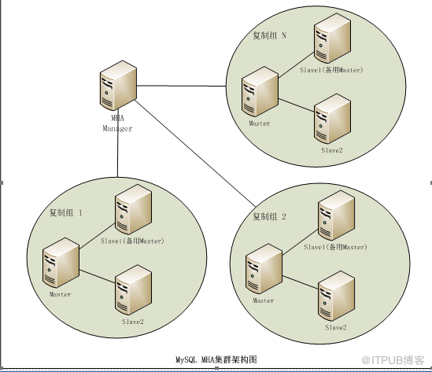
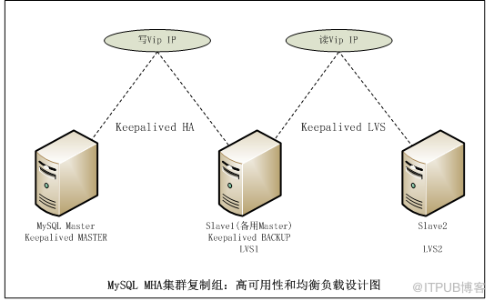
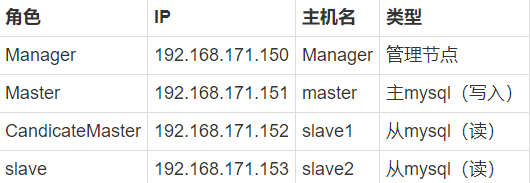
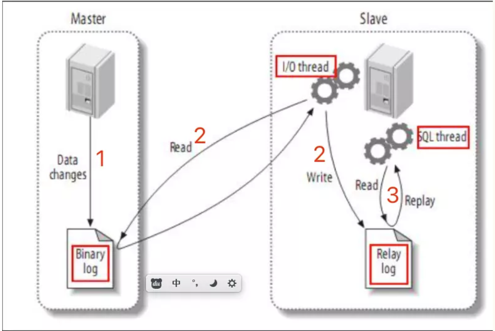

## 基础

## 集群架构

- 主从  
  默认从只做备份，但是可以通过配置达到读写分离的效果

- 双主 2个互为主从  
  

- MHA   
  总架构  
  

  组内架构  
  

  MHA Manager可以单独部署 在一台独立的机器上管理多个master-slave集群，也可以部署在一台slave节点上。MHA Node运行在每台 MySQL服务器上，MHA
  Manager会定时探测集群中的master节点，当master出现故障时，它可以自动将最新 数据的slave提升为新的master，然后将所有其他的slave重新指向新的master。整个故障转移过程对应用程序完 全透明。

  假设每个mysql组配置如下一主二从：
  

  其中master对外提供写服务，备选master（实际的slave，主机名slave1）提供读服务，slave也提供相关的读服务，一旦master宕机，将会把备选master提升为新的master，slave指向新的master，manager作为管理服务器。

## 主从复制

**主从复制与redis区别：redis在启动时候用全量同步rdb，后面用增量同步；而mysql从刚启动时候就要指定主的binlog的位置进行同步！！！**  
  
**前提是作为主服务器角色的数据库服务器必须开启二进制日志
注意：第一次同步时候，最好两个库的结构一样，就是库表都一致，因为主从复制时候从要配置一个position，这个position就是主的binlog的位置，如果不一样，会导致主插入一条数据，而从没有这个表导致错误。**

**主从复制（默认的模式，属于异步复制）**  
（1）master服务器将数据的改变记录二进制binlog日志，当master上的数据发生改变时，则将其改变写入二进制日志中；   
（2）slave服务器生成I/OThread不断向主库发送请求（带有偏移量），主控收到请求生成log dump thread把新的数据传到slave   
（3）salve服务的I/OThread保存至从节点本地的中继日志中，从节点将启动SQL线程从中继日志中读取二进制日志，在本地重放，使得其数据和主节点的保持一致，最后I/OThread和SQLThread将进入睡眠状态，等待下一次被唤醒。

**全同步主从复制（默认关闭，要在配置里打开，不建议使用）**  
跟半同步差不多，只是要全部从返回ack，主才会返回客户端成功

**半同步主从复制（默认关闭，要在配置里打开）**  
解决网络延时或者主挂了导致数据丢失 主库写入 binlog 之后并不会马上返回客户端，从库写完中继日志返回 ack，主库收到至少一个从库返回的 ack 之后才会返回客户端成功

**并行复制（默认关闭，要在配置里打开）**  
解决主从同步延时问题。 由于主库上可以多客户端并发的写入，当主库的TPS较高时，由于从库的SQL线程是单线程的，导致从库处理速度可能会跟不上主库的处理速度，从而造成了延迟  
从库开启多个线程，并行读取从主库同步来的不同库的日志，然后并行重放不同库的日志，这是库级别的并行

**主从同步延时问题解决方案**

- 水平分库+并行复制
- 写入后不能立即读
- 写入后直连主库立即读