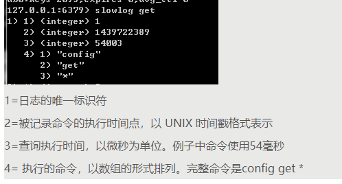
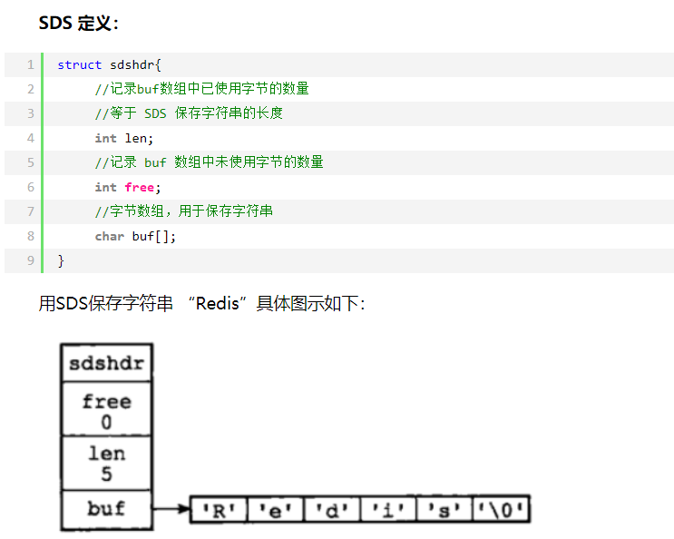
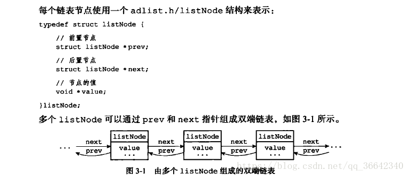
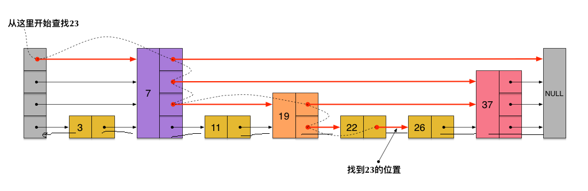
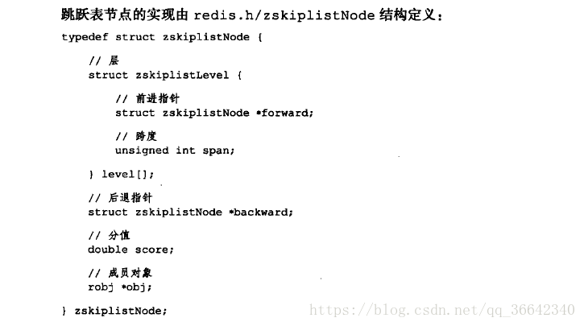
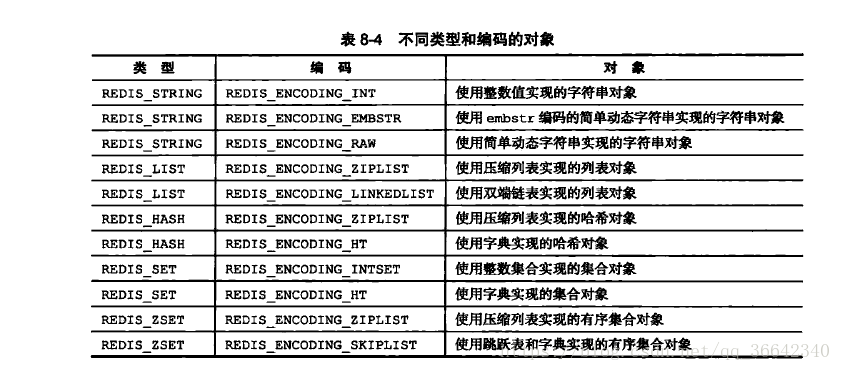
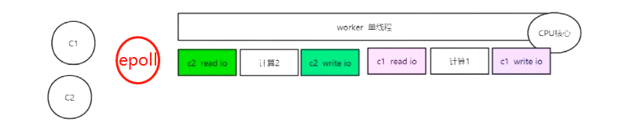
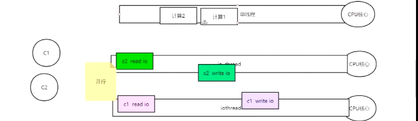

## 基础知识


- **redis和memcache区别**
    - redis是串行的，一条数据处理完下一条才能处理
    - memcache并行多线程执行。
- **redis的key可以用冒号来分割**，可以自动归档，在可视化界面下就可以看到所有key都在同一个文件夹下。
- **aof和rdb区别**
    - rdb就是快照，相当于把整个数据库备份一遍
    - aof除了查以为外的命令都会被记录下来
- **淘汰算法**
    - volatile-lru：使用LRU算法进行数据淘汰（淘汰上次使用时间最早的，且使用次数最少的key），只淘汰设定了有效期的key
    - allkeys-lru：使用LRU算法进行数据淘汰，所有的key都可以被淘汰
    - volatile-lfu：从所有配置了过期时间的键中驱逐使用频率最少的键
    - allkeys-lfu：从所有键中驱逐使用频率最少的键
    - volatile-random：随机淘汰数据，只淘汰设定了有效期的key
    - allkeys-random：随机淘汰数据，所有的key都可以被淘汰
    - volatile-ttl：淘汰剩余有效期最短的key
    - no-enviction：不淘汰（默认）
- **查询慢日志（slowlog get）**
    - 

## [【redis 底层数据结构与数据类型 ppt】](../resources/redis.pptx)

### 底层数据结构
1. 简单动态字符串（SDS）
   

2. 链表 就是简单的双向链表
   

3. 哈希表 跟hashmap原理差不多 扩容：
    - 有两个哈希表h0和h1，先扩大h1大小
    - murmurhash(key) & sizemark
    - 渐近式哈希，复制的过程不是一口气，完成的 而是一部分一部分完成的

4. 跳跃表（zrange、zrank、zrangebyscore） 每个节点有个level数组，level具体是多少是随机生成的。level每一个元素里有指向下一个节点的指针和跨越多少个节点，用来计算rank
   redis对跳跃表做了改良：①使得第一层是一个双向链表（ 这是为了方便以倒序方式获取一个范围内的元素）。②每个节点存了到每个下节点跨越的个数（跟指针是一一对应，用来计算rank）
   详细看： https://www.cnblogs.com/Elliott-Su-Faith-change-our-life/p/7545940.html
   
   


5. 整数集合  
   

6. 压缩列表（ziplist） 一个内存空间连续的双向链表（普通链表内存不连续）  
   5种redis数据结构都是由2种底层结构组成，根据不同情况使用不同数据结构，但是基本都是量少才用ziplist  
   

### 数据类型
#### 基础数据类型
kv、list、map、set、zset
#### 高级数据类型
- **bitmap**
  - 方法
    - getbit key offset: 对key所存储的字符串值，获取指定偏移量上的位（bit）
    - setbit key offset value: 对key所存储的字符串值，设置或清除指定偏移量上的位（bit）。返回值为该位在setbit之前的值
    - bitcount key [start end]: 获取位图指定范围中位值为1的个数，如果不指定start与end，则取所有
    - bitop op destKey key1 [key2...]: 做多个BitMap的and（交集）、or（并集）、not（非）、xor（异或）操作并将结果保存在destKey中
    - bitpos key tartgetBit [start end]: 计算位图指定范围第一个偏移量对应的的值等于targetBit的位置。找不到返回-1。start与end没有设置，则取全部
  - 使用场景：参考地址：https://www.cnblogs.com/wuhaidong/articles/10389484.html  
    - 用户签到，在线，统计活跃用户
    - 布隆过滤器
  - offset优化建议：由于最大大小为512M，那么我们如果要把一个很大的long（比如用户id）当做offset，一来浪费空间，二来也存不下。可以采用如下优化方法：拆分n个key，例如：bitmap的key是userId/n，offset可以设置为userId%n

- **hyperloglog**
  - 方法
    - pfadd：增加计数（和set的sadd用法一样，来一个往里面放一个）
    - pfcount：获取计数（和scard的用法一样，直接获取计数）
    - pfmerage：将多个pf计数累加再一起形成一个新的pf值
  - 使用场景：用于做基数统计。什么是基数? 比如数据集 {1, 3, 5, 7, 5, 7, 8}， 那么这个数据集的基数集为 {1, 3, 5 ,7, 8}, 基数(不重复元素)为5。 基数估计就是在误差可接受的范围内，快速计算基数

## 穿透、击穿、雪崩
1. 穿透  
   在高并发下，查询一个不存在的值时（黑客行为），缓存不会被命中，导致大量请求直接落到数据库上，如活动系统里面查询一个不存在的活动。
   - 布隆过滤器
   - 缓存空值，但是时间不能太长，下次进来是直接返回不存在，但是这种情况无法过滤掉动态的key，就是说每次请求进来都是不同的key，这样还是会造成这个问题
2. 击穿  
   在高并发下，对一个特定的值进行查询，但是这个时候缓存正好过期了，缓存没有命中，导致大量请求直接落到数据库上，如活动系统里面查询活动信息，但是在活动进行过程中活动缓存突然过期了。  
   通过synchronized+双重检查机制：某个key只让一个线程查询，阻塞其它线程  
```
private static volaite Object lockHelp=new Object();

   public String getValue(String key){
     String value=redis.get(key,String.class);
     
     if(value=="null"||value==null||StringUtils.isBlank(value){
         synchronized(lockHelp){
                value=redis.get(key,String.class);
                 if(value=="null"||value==null||StringUtils.isBlank(value){
                     value=db.query(key);
                      redis.set(key,value,1000);
                  }
            }
           }    

        return value;
   }
```
3. 雪崩  
   在高并发下，大量的缓存key在同一时间失效，导致大量的请求落到数据库上，如活动系统里面同时进行着非常多的活动，但是在某个时间点所有的活动缓存全部过期。
   - 可以通过缓存reload机制，预先去更新缓存，再即将发生大并发访问前手动触发加载缓存
   - 不同的key，设置不同的过期时间，具体值可以根据业务决定，让缓存失效的时间点尽量均匀


## 线程模型
<font color=red>**redis6以下**</font>  
是单线程的reactor模型，网络io和计算都是用同一个线程执行的  


<font color=red>**redis6**</font>  
改为io是多线程，但是工作线程还是只有一个


