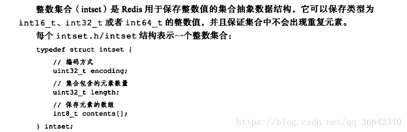

[redis ppt](../resources/redis.pptx)

## 底层数据结构

1. 简单动态字符串（SDS）
   

2. 链表 就是简单的双向链表
   

3. 哈希表 跟hashmap原理差不多 扩容：
    - 有两个哈希表h0和h1，先扩大h1大小
    - murmurhash(key) & sizemark
    - 渐近式哈希，复制的过程不是一口气，完成的 而是一部分一部分完成的

4. 跳跃表（zrange、zrank、zrangebyscore） 每个节点有个level数组，level具体是多少是随机生成的。level每一个元素里有指向下一个节点的指针和跨越多少个节点，用来计算rank
   redis对跳跃表做了改良：①使得第一层是一个双向链表（ 这是为了方便以倒序方式获取一个范围内的元素）。②每个节点存了到每个下节点跨越的个数（跟指针是一一对应，用来计算rank）
   详细看： https://www.cnblogs.com/Elliott-Su-Faith-change-our-life/p/7545940.html
   
   

5. 整数集合  
   

6. 压缩列表（ziplist） 一个内存空间连续的双向链表（普通链表内存不连续）  
   5种redis数据结构都是由2种底层结构组成，根据不同情况使用不同数据结构，但是基本都是量少才用ziplist  
   

## 数据结构  
