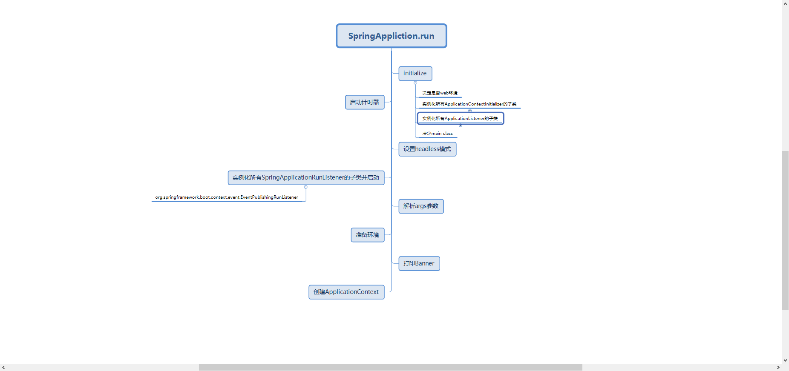

## 启动过程

### @SpringBootApplication注解解释
这是一个复合注解：@SpringBootConfiguration、@ComponentScan、@EnableAutoConfiguration  
- @SpringBootConfiguration：继承@Configuration，所以可以在启动类直接定义@Bean 
- @ComponentScan：包扫描，value没填值，默认为使用该注解的类的所在包路径
- @EnableAutoConfiguration：实现自动装配。
  - @AutoConfigurationPackage
    - 就一个作用：创建一个BasePackages类型的Bean，注册到容器。这个类有一个属性，就是启动类所在的包路径。根据作者的注释（原文：用于存储自动配置包以供以后参考的类（例如，通过 JPA 实体扫描器））可以看出这个bean的作用是仅仅存储所在类所在的包路径，供其他组件扫描使用。  
  - @Import(AutoConfigurationImportSelector.class)
    - 这里有个小插曲2.0的低版本跟高版本代码有些许变化，我看2.0.4时候主要逻辑在主类的selectorImport里，2.2.7时候在一个内部类
    - 核心代码
```
protected AutoConfigurationEntry getAutoConfigurationEntry(AutoConfigurationMetadata autoConfigurationMetadata, AnnotationMetadata annotationMetadata) {
  if (!isEnabled(annotationMetadata)) {
    return EMPTY_ENTRY;
  }
  
  // 获取import该类的注解的属性
  AnnotationAttributes attributes = getAttributes(annotationMetadata);
  // 把所有META-INF/spring.factories内容加载到一个map里，然后这里只从map里去自动装载的配置
  List<String> configurations = getCandidateConfigurations(annotationMetadata, attributes);
  // 下面这几行都是根据属性进行筛选过滤
  configurations = removeDuplicates(configurations);
  Set<String> exclusions = getExclusions(annotationMetadata, attributes);
  checkExcludedClasses(configurations, exclusions);
  configurations.removeAll(exclusions);
  configurations = filter(configurations, autoConfigurationMetadata);
  fireAutoConfigurationImportEvents(configurations, exclusions);
  return new AutoConfigurationEntry(configurations, exclusions);
}
```

### run方法
1. main方法一路点进去，先初始化    
①判断是否是web环境（为下面创建applicationxontext做准备）  
②加载META-INFO/spring.factories下的applicationcontextInitializer所有实现类并实例化（在下文的run方法里会逐一执行）  
③加载META-INFO/spring.factories下的applicationlistener所有实现类并实例化  
④获取启动类class  
2. 顺着 run继续往下走  
①设置无头模式  
②获取事件分发器（也就是EventPublishingRunListener）  
③解析参数，把java -jar里的配置和配置文件加载到一个Environment对象里  
④打印banner  
⑤根据web环境创建applicaitoncontext（ConfigurableApplicationContext）  
⑥创建失败分析器  
⑦逐一执行上述的initializer方法，并且加载启动类到容器里去  
⑧refresh  
⑨查找当前context中是否注册有CommandLineRunner和ApplicationRunner，如果有则遍历执行它们。  

