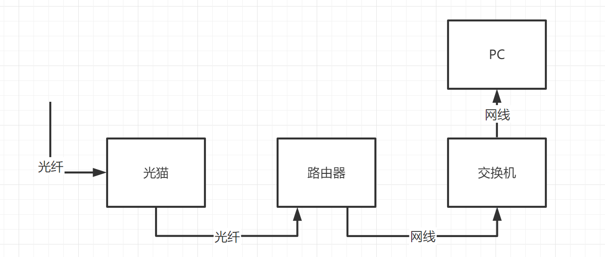

## 猫、路由器、交换机

- 猫：光猫一般都是运营商把光纤接入到家中时，运营商提供的。用网线接上电脑，登入运营商提供的账号密码即可实现上网。
- 路由器：虽然有猫就可以上网了，但是通常家中会有多台设备需要通过有线或者无线方式上网，这时光猫提供的网口不够用，就需要用到路由器。用网线连接路由器的WAN口和光猫的网络口。
- 交换机：当路由器的网口不够用的时候，可以再接入一个交换机来扩展。交换机一定要接入路由器使用，不能直接接入光猫使用，只有这样才能保证在只开通一个运营商账号的情况下正常接入多个设备上网。用网线连接路由器的任何一个LAN口和交换机的任何一个网口。