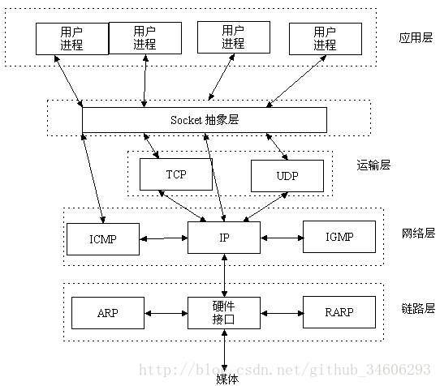
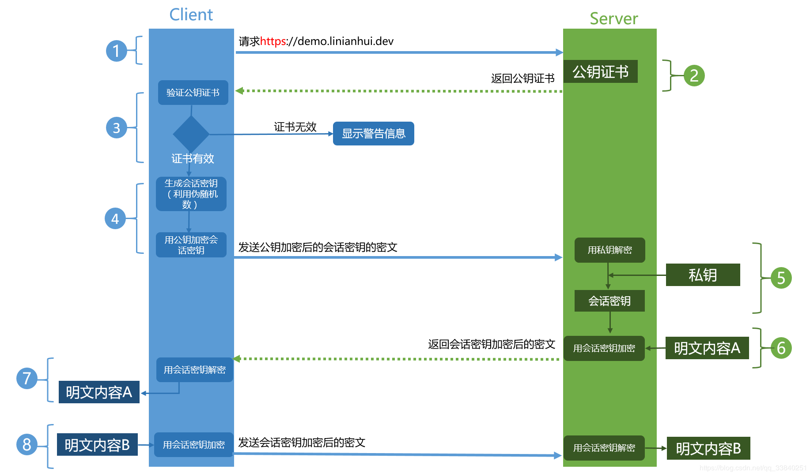

## 1. 网络通信模型

[介绍图片](https://pic3.zhimg.com/80/v2-4fe0b5f06fc89af2f98ebd2690bc87ea_1440w.jpg)

- TCP/IP 模型（四层）：应用层、传输层、网络层、数据链路层
- OSI 模型 （七层）：应用层、表示层、会话层、传输层、网络层、数据链路层、物理层

### 1.1. 分层的作用

- 应用层：操作系统或网络应用程序提供访问网络服务的接口。应用层协议的代表包括：Telnet、FTP、HTTP、SNMP 等
- 表示层：将应用处理的信息转换为适合网络传输的格式，或将来自下一层的数据转换为上层能够处理的格式。数据的表示、安全、压缩
- 会话层：负责建立和断开通信连接（数据流动的逻辑通路），以及数据的分割等数据传输相关的管理
- 传输层：管理两个节点之间的数据传输。负责可靠传输（确保数据被可靠地传送到目标地址）
- 网络层：负责地址管理与路由选择, 在这一层，数据的单位称为数据包（packet）（路由器）
- 数据链路层：负责互连设备之间传送和识别数据帧（交换机）
- 物理层：以"0"、 "1"代表电压的高低，灯光的闪灭，在这一层，数据的单位称为比特（bit）,（中继器、集线器、还有我们通常说的双绞线也工作在物理层）

### 1.2. Socket

socket是对TCP/IP协议的封装，它的出现只是使得程序员更方便地使用TCP/IP协议栈而已。socket本身并不是协议，它是应用层与TCP/IP协议族通信的中间软件抽象层，是一组调用接口（TCP/IP网络的API函数）.TCP/IP也要提供可供程序员做网络开发所用的接口，这就是Socket编程接口  


## 2. 网络通信协议

协议类型：TCP、UDP、HTTP、HTTPS、HTTP2

### 2.1. TCP/IP

[介绍地址 1](http://www.ruanyifeng.com/blog/2017/06/tcp-protocol.html)

[介绍地址 2](https://zhuanlan.zhihu.com/p/33889997)

- Application（应用层）-->TCP-->IP-->Ethernet（以太网）
- 互联网由一整套协议构成。TCP 只是其中的一层（传输层）
- TCP 是以太网协议和 IP 协议的上层协议，也是应用层协议的下层协议
- 最底层的以太网协议（Ethernet）规定了电子信号如何组成数据包（packet），解决了子网内部的点对点通信，也就是解决了局域网的点对点通信
- 但是，以太网协议不能解决多个局域网如何互通，这由 IP 协议解决
- IP 协议只是一个地址协议，并不保证数据包的完整。如果路由器丢包（比如缓存满了，新进来的数据包就会丢失），就需要发现丢了哪一个包，以及如何重新发送这个包。这就要依靠 TCP 协议
- TCP 协议的作用是，保证数据通信的完整性和可靠性，防止丢包

#### 2.1.1. TCP 数据包大小

- 以太网数据包（packet）的大小是固定的，最初是 1518 字节，后来增加到 1522 字节。其中， 1500 字节是负载（payload），22 字节是头信息（head）
- IP 数据包在以太网数据包的负载里面，它也有自己的头信息，最少需要 20 字节，所以 IP 数据包的负载最多为 1480 字节
- TCP 数据包在 IP 数据包的负载里面。它的头信息最少也需要 20 字节，因此 TCP 数据包的最大负载是 1480 - 20 = 1460 字节。由于 IP 和 TCP 协议往往有额外的头信息，所以 TCP 负载实际为 1400
  字节左右

#### 2.1.2. SEQ、ACK、SYN、FIN

- SEQ（Sequence Number）：TCP 协议会为每个包编号（sequence number，简称 SEQ），以便接收的一方按照顺序还原。万一发生丢包，也可以知道丢失的是哪一个包
- ACK（Acknowledgement）：TCP 协议规定，只有 ACK=1 时有效，也规定连接建立后所有发送的报文的 ACK 必须为 1
- SYN（Synchronization）： 在连接建立时用来同步序号。当 SYN=1 而 ACK=0 时，表明这是一个连接请求报文。对方若同意建立连接，则应在响应报文中使 SYN=1 和 ACK=1. 因此, SYN 置 1
  就表示这是一个连接请求或连接接受报文
- FIN （Finish）：用来释放一个连接。当 FIN = 1 时，表明此报文段的发送方的数据已经发送完毕，并要求释放连接

#### 2.1.3. 三次握手

- 简介  
  
    - 所谓三次握手(Three-way Handshake)，是指建立一个 TCP 连接时，需要客户端和服务器总共发送 3 个包
    - 三次握手的目的是连接服务器指定端口，建立 TCP 连接，并同步连接双方的序列号和确认号，交换 TCP 窗口大小信息。在 socket 编程中，客户端执行 connect() 时。将触发三次握手
        - 第一次：client往server端发syn
        - 第二次：server往client端回syn+ack
        - 第三次：client往server端发ack

#### 2.1.4. 四次挥手

- 简介  
  
    - TCP 的连接的拆除需要发送四个包，因此称为四次挥手(Four-way handshake)，也叫做改进的三次握手。客户端或服务器均可主动发起挥手动作，在 socket 编程中，任何一方执行 close() 操作即可产生挥手操作
        - 第一次：client往server端发fin
        - 第二次：server往client发ack
        - 第三次：server往client发fin
        - 第四次：client往server端发ack

#### 2.1.5.面试题1：为啥要三次握手，四次挥手

这里第三次是因为server端fin可能没法完，所以只能先回ack，等数据传完了,再回客户端一个fin信号

#### 2.1.6.面试题2：为啥要3次握手

为了防止已失效的连接请求报文段突然又传送到了服务端，因而产生错误。  
例如：c往s发连接请求，超时了c重发，这次成功了。这时候第一次的请求突然到了s端，就产生了一次失效连接。

### 2.2. UDP

- UDP 是无连接的，即发送数据之前不需要建立连接(发送数据结束时也没有连接可释放)，减少了开销和发送数据之前的时延
- UDP 使用尽最大努力交付，即不保证可靠交付，主机不需要维持复杂的连接状态表
- UDP 是面向报文的，发送方的 UDP 对应用程序交下来的报文，在添加首部后就向下交付 IP 层。UDP 对应用层交下来的报文，既不合并，也不拆分，而是保留这些报文的边界
- UDP 没有拥塞控制，网络出现的拥塞不会使源主机的发送速率降低
- UDP 支持一对一、一对多、多对一和多对多的交互通信
- UDP 的首部开销小，只有 8 个字节，比 TCP 的 20 个字节的首部要短

### 2.3. HTTP

[介绍地址](https://www.ruanyifeng.com/blog/2016/08/http.html)

- HTTP 是一个属于应用层的面向对象的协议
- 基于 TCP/IP 协议的应用层协议。它不涉及数据包（packet）传输，主要规定了客户端和服务器之间的通信格式，默认使用 80 端口

#### 2.3.1. HTTP/0.9

- HTTP（Hyper Text Transfer Protocol（超文本传输协议）） 的最早版本是 1991 年发布的 0.9 版。该版本极其简单，只有一个命令 GET
- 用于客户端向服务器请求（request）网页
- 协议规定，服务器只能回应 HTML 格式的字符串，不能回应别的格式
- 服务器发送完毕，就关闭 TCP 连接

#### 2.3.2. HTTP/1.0

- 1996 年 5 月，HTTP/1.0 版本发布，内容大大增加
- 该版本新增功能：
    - **内容格式**：请求格式任何格式的内容都可以发送。这使得互联网不仅可以传输文字，还能传输图像、视频、二进制文件
    - **请求方法**：除了 GET 命令，还引入了 POST 命令和 HEAD 命令
    - **请求和响应格式**：HTTP 请求和回应的格式也变了。除了数据部分，每次通信都必须包括头信息（HTTP header），用来描述一些元数据
    - **Content-Type**：关于字符的编码，1.0 版规定，头信息必须是 ASCII 码，后面的数据可以是任何格式。因此，服务器回应的时候，必须告诉客户端，数据是什么格式，这就是 Content-Type 字段的作用
    - **Content-Encoding**：由于发送的数据可以是任何格式，因此可以把数据压缩后再发送。Content-Encoding 字段说明数据的压缩方法
    - **其他**：其他的新增功能还包括状态码（status code）、多字符集支持、多部分发送（multi-part type）、权限（authorization）、缓存（cache）、内容编码（content
      encoding）等
- 缺点：
    - 每个 TCP 连接只能发送一个请求。发送数据完毕，连接就关闭，如果还要请求其他资源，就必须再新建一个连接（可以通过添加 Connection: keep-alive 的 Header 来优化）

#### 2.3.3. HTTP/1.1

- 1997 年 1 月，HTTP/1.1 版本发布
- 该版本新增功能：
    - **持久连接**：引入了持久连接（persistent connection），即 TCP 连接默认不关闭，可以被多个请求复用，不用声明 Connection: keep-alive，对于同一个域名，大多数浏览器允许同时建立 6
      个持久连接
    - **管道机制**：引入了管道机制（pipelining），即在同一个 TCP 连接里面，客户端可以同时发送多个请求。这样就进一步改进了 HTTP 协议的效率
    - Content-Length：新增 Content-Length 的 Header（因为一个 TCP 连接现在可以传送多个 Response）
    - **分块传输编码**：采用"流模式"（stream）取代"缓存模式"（buffer），只要请求或回应的头信息有 Transfer-Encoding 字段，就表明回应将由数量未定的数据块组成
    - 请求方法：新增了许多动词方法：PUT、PATCH、HEAD、 OPTIONS、DELETE
    - 自定义 Host：客户端请求的头信息新增了 Host 字段，用来指定服务器的域名
- 缺点：
    - 虽然 1.1 版允许复用 TCP 连接，但是同一个 TCP 连接里面，所有的数据通信是按次序进行的。服务器只有处理完一个回应，才会进行下一个回应。要是前面的回应特别慢，后面就会有许多请求排队等着。这称为"队头堵塞"

#### 2.3.4. HTTP2

- 2009 年，谷歌公开了自行研发的 SPDY 协议，主要解决 HTTP/1.1 效率不高的问题  
  这个协议在 Chrome 浏览器上证明可行以后，就被当作 HTTP/2 的基础，主要特性都在 HTTP/2 之中得到继承
- 2015 年，HTTP/2 发布。它不叫 HTTP/2.0，是因为标准委员会不打算再发布子版本了，下一个新版本将是 HTTP/3
- 该版本新增功能：
    - **二进制协议**：HTTP/1.1 版的头信息肯定是文本（ASCII 编码），数据体可以是文本，也可以是二进制。HTTP/2 则是一个彻底的二进制协议，头信息和数据体都是二进制，并且统称为"帧"
      （frame）：头信息帧和数据帧，二进制协议的一个好处是，可以定义额外的帧。HTTP/2 定义了近十种帧
    - **多路复用（Multiplexing）**：HTTP/2 复用 TCP 连接，在一个连接里，客户端和浏览器都可以同时发送多个请求或回应，而且不用按照顺序一一对应，这样就避免了"队头堵塞"
    - **数据流**：因为 HTTP/2 的数据包是不按顺序发送的，同一个连接里面连续的数据包，可能属于不同的回应。因此，必须要对数据包做标记，指出它属于哪个回应。HTTP/2
      将每个请求或回应的所有数据包，称为一个数据流（stream）。每个数据流都有一个独一无二的编号。数据包发送的时候，都必须标记数据流 ID，用来区分它属于哪个数据流。另外还规定，客户端发出的数据流，ID
      一律为奇数，服务器发出的，ID 为偶数。数据流发送到一半的时候，客户端和服务器都可以发送信号（RST_STREAM 帧），取消这个数据流。1.1 版取消数据流的唯一方法，就是关闭 TCP 连接。这就是说，HTTP/2
      可以取消某一次请求，同时保证 TCP 连接还打开着，可以被其他请求使用。客户端还可以指定数据流的优先级。优先级越高，服务器就会越早回应
    - **头信息压缩**：HTTP/2 对这一点做了优化，引入了头信息压缩机制（header compression）。一方面，头信息使用 gzip 或 compress
      压缩后再发送；另一方面，客户端和服务器同时维护一张头信息表，所有字段都会存入这个表，生成一个索引号，以后就不发送同样字段了，只发送索引号，这样就提高速度了
    - **服务器推送**：HTTP/2 允许服务器未经请求，主动向客户端发送资源，这叫做服务器推送（server push）

#### 2.3.5. HTTPS

[介绍地址](https://www.ruanyifeng.com/blog/2014/02/ssl_tls.html)

##### 2.3.5.1. 简介

- HTTPS 为使用 SSL/TLS 的 HTTP 通信
- 作用：
    - 所有信息都是加密传播，第三方无法窃听
    - 具有校验机制，一旦被篡改，通信双方会立刻发现
    - 配备身份证书，防止身份被冒充
- 发展史：
  ```
  1994年，NetScape公司设计了SSL协议（Secure Sockets Layer）的1.0版，但是未发布。
  1995年，NetScape公司发布SSL 2.0版，很快发现有严重漏洞。
  1996年，SSL 3.0版问世，得到大规模应用。
  1999年，互联网标准化组织ISOC接替NetScape公司，发布了SSL的升级版TLS 1.0版。
  2006年和2008年，TLS进行了两次升级，分别为TLS 1.1版和TLS 1.2版。最新的变动是2011年TLS 1.2的修订版。
  ```

##### 2.3.5.2. 版本

- 目前，应用最广泛的是 TLS 1.0，接下来是 SSL 3.0。但是，主流浏览器都已经实现了 TLS 1.2 的支持
- TLS 1.0 通常被标示为 SSL 3.1，TLS 1.1 为 SSL 3.2，TLS 1.2 为 SSL 3.3

##### 2.3.5.3. 基本的运行过程

  
1~7步是SSL握手过程，8、9是后续请求。   
4、5可以用rsa  
6、7、8、9（最后一步）可以用aes

#### 2.3.6. HTTP 码对照表

https://tool.oschina.net/commons?type=5

#### 2.3.7. HTTP 的 GET 和 POST 的区别

[介绍地址](https://www.cnblogs.com/hyddd/archive/2009/03/31/1426026.html)

- GET 请求的数据会附在 URL 之后（部分浏览器会限制 URL 长度，IE 为 2KB）
- Get 是向服务器发索取数据的一种请求，而 Post 是向服务器提交数据的一种请求

## 3. 网络安全

### 3.1. 注入攻击

- 注入式（Inject）攻击是一类非常常见的攻击方式，其基本特征是程序允许攻击者将不可信的动态内容注入到程序中，并将其执行，这就可能完全改变最初预计的执行过程，产生恶意效果
- 常见注入攻击手段：
    - SQL 注入：select _ from user where name = “input_usr_name”，input_user_name=“ or “”=”，得到的 SQL 为 select _ from user
      where name = "" or ""=""，类似场景可以利用注入的不同 SQL 语句，进行各种不同目的的攻击
    - 操作系统命令注入：Java 语言提供了类似 Runtime.exec(…) 的 API，可以用来执行特定命令，所以可以类似 SQL 注入一样注入系统命令
    - XML 注入：Java 核心类库提供了全面的 XML 处理、转换等各种 API，而 XML 自身是可以包含动态内容的，例如 XPATH，如果使用不当，可能导致访问恶意内容
    - LDAP 注入、XSS（Cross-site Scripting）注入等

### 3.2. DDOS 攻击

[介绍地址](http://www.ruanyifeng.com/blog/2018/06/ddos.html)

全称是 Distributed Denial of
Service，翻译成中文就是分布式拒绝服务。一般来说是指攻击者利用“肉鸡”对目标网站在较短的时间内发起大量请求，大规模消耗目标网站的主机资源，让它无法正常服务。在线游戏、互联网金融等领域是 DDoS 攻击的高发行业

### 3.3. 拖库、洗库、撞库

[介绍地址](https://zhuanlan.zhihu.com/p/69979644)

#### 3.3.1. 拖库

拖库就是指黑客通过各种社工手段、技术手段（对网站进行扫描，寻找漏洞，类如 SQL
注入、文件上传漏洞等）将数据库中敏感信息非法获取，一般这些敏感信息包括用户的账号信息如用户名、密码；身份信息如真实姓名、证件号码；通讯信息如电子邮箱、电话、住址等

#### 3.3.2. 洗库

在拖库后，取得大量的用户数据之后，黑客会通过一系列的技术手段和黑色产业链将有价值的用户数据变现，这通常也被称作“洗库”

#### 3.3.3. 撞库

撞库是黑客通过收集互联网已泄露的用户和密码信息，生成对应的字典表，尝试批量登陆其他网站后，得到一系列可以登录的用户。很多用户在不同网站使用的是相同的帐号密码，因此黑客可以通过获取用户在 A 网站的账户从而尝试登录 B
网址，这就可以理解为撞库攻击