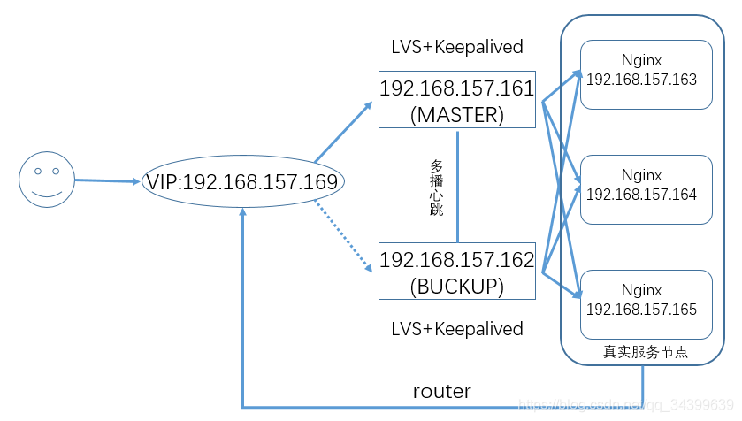

## CDN

[介绍地址](https://www.zhihu.com/question/36514327)

- CDN 的全称是 Content Delivery Network，即内容分发网络
- 基本思路：实时地根据网络流量和各节点的连接、负载状况以及到用户的距离和响应时间等综合信息将用户的请求重新导向离用户最近的服务节点上

## DNS

[介绍地址](https://www.ruanyifeng.com/blog/2016/06/dns.html)

- DNS （Domain Name System 的缩写）的作用非常简单，就是根据域名查出 IP 地址

## 正向代理、反向代理

- 正向代理代理的对象是客户端，反向代理代理的对象是服务端
- 例如：
    - 由于防火墙的原因，我们并不能直接访问谷歌，那么我们可以借助 VPN 来实现，这就是一个简单的正向代理的例子
    - 当我们在外网访问百度的时候，其实会进行一个转发，代理到百度的不同服务器去，这就是所谓的反向代理

## Lvs

[介绍地址](https://zhuanlan.zhihu.com/p/87109094)

- LVS，全称 Linux Virtual Server，是国人章文嵩发起的一个开源项目
- LVS 是一个工作在网络的**第四层**（传输层）、具有强大性能的反向代理服务器，支持反向代理、负载均衡等功能
- LVS 采用的是同步请求转发的策略，LVS 接收到请求之后，立即 redirect 到一个后端服务器，由客户端直接和后端服务器建立连接
- 缺点：
    - LVS 没有故障转移机制，一旦后端接受到请求的服务器出了问题，那么这次请求就失败

## Haproxy

可以实现4层、7层，一般来说地位跟Lvs差不多，做tcp负载均衡器。

## Keepalived

Keepalived的作用是检测服务器的状态，如果有一台web服务器宕机，或工作出现故障，Keepalived将检测到，并将有故障的服务器从系统中剔除，同时使用其他服务器代替该服务器的工作，当服务器工作正常后Keepalived自动将服务器加入到服务器群中，这些工作全部自动完成，不需要人工干涉，需要人工做的只是修复故障的服务器

#### VIP

是keepalived虚拟出的一个ip，正常时候只会访问keepalived主节点，当主节点挂了，就飘到从节点上。

## nginx

## 高可用架构

